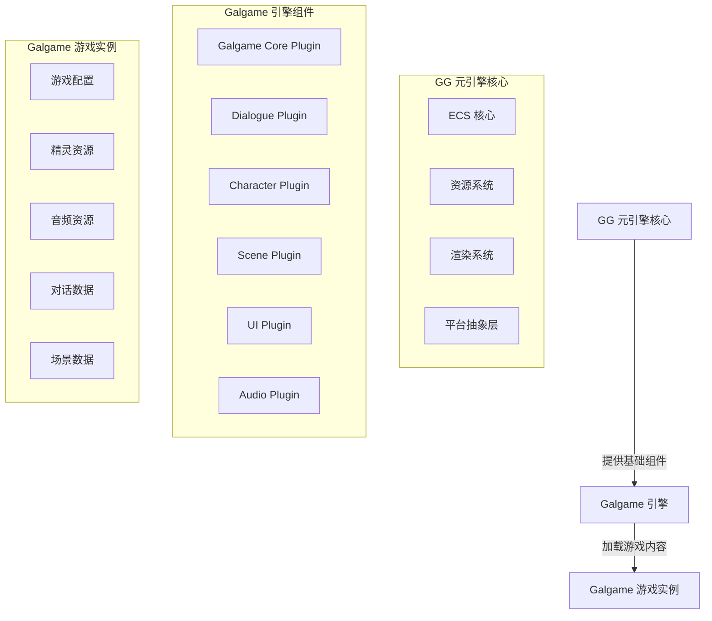

# Galgame 引擎架构设计

## 1. 架构概述

Galgame（美少女游戏）引擎是基于 GG 元引擎框架构建的具体游戏引擎，专注于视觉小说和恋爱模拟游戏类型的开发。本架构设计文档详细说明了 Galgame 引擎的整体结构、核心组件和实现方案，特别是对话系统、角色系统和剧情管理的设计。

## 2. 设计理念

Galgame 引擎遵循 GG 元引擎的设计理念，采用以下核心原则：

- **ECS 作为统一核心**：所有游戏逻辑通过 ECS 系统执行，确保性能和数据驱动
- **插件化架构**：通过插件组合机制实现功能扩展
- **平台抽象层**：屏蔽平台差异，提供统一接口
- **静态与动态分离**：编译时生成具体引擎，运行时加载游戏内容
- **剧情驱动设计**：实现适合视觉小说游戏的剧情管理和对话系统

## 3. 架构层次

Galgame 引擎架构分为以下层次：

1. **核心层**：基于 GG 元引擎的 ECS 核心、资源系统、渲染系统等
2. **引擎层**：Galgame 专用的组件、系统和插件，特别是对话系统和剧情管理
3. **游戏层**：具体的游戏内容和逻辑

## 4. 核心组件

### 4.1 实体组件（ECS）

#### 核心组件

- **Transform**：位置和旋转信息
- **Sprite**：精灵渲染信息
- **Dialogue**：对话内容和状态
- **Character**：角色信息和状态
- **Scene**：场景信息和状态
- **Choice**：选择项信息
- **Audio**：音频播放信息
- **SaveData**：存档数据

#### 核心系统

- **DialogueSystem**：处理对话逻辑和显示
- **CharacterSystem**：处理角色管理和状态
- **SceneSystem**：处理场景切换和管理
- **ChoiceSystem**：处理选择项逻辑
- **AudioSystem**：处理音频播放
- **SaveSystem**：处理存档和读档
- **RenderSystem**：处理渲染逻辑

### 4.2 插件系统

Galgame 引擎包含以下核心插件：

- **Galgame Core Plugin**：提供 Galgame 游戏的核心功能
- **Dialogue Plugin**：提供对话系统功能
- **Character Plugin**：提供角色管理功能
- **Scene Plugin**：提供场景管理功能
- **UI Plugin**：提供游戏界面
- **Audio Plugin**：提供音频播放功能

### 4.3 资源管理

- **Sprite 资源**：角色立绘、背景图片等
- **Audio 资源**：音效和背景音乐
- **MDX 资源**：使用 MDX 格式编写的对话文本和剧情数据
- **Scene 资源**：场景配置和数据

## 5. 架构图

## 6. 关键功能实现

### 6.1 对话系统

- **对话管理**：管理对话文本和显示
- **角色对话**：处理不同角色的对话逻辑
- **对话选项**：实现对话中的选择项
- **对话分支**：根据选择项处理对话分支

### 6.2 角色系统

- **角色管理**：管理游戏中的角色
- **角色立绘**：处理角色立绘的显示和切换
- **角色状态**：管理角色的状态和属性
- **角色表情**：处理角色表情的变化

### 6.3 场景系统

- **场景管理**：管理游戏中的场景
- **场景切换**：处理场景之间的切换
- **场景背景**：管理场景背景的显示
- **场景特效**：处理场景中的特效

### 6.4 剧情管理

- **剧情流程**：管理游戏的剧情流程
- **剧情分支**：处理剧情的不同分支
- **剧情触发**：处理剧情事件的触发
- **剧情进度**：管理剧情的进度

### 6.5 存档系统

- **存档管理**：管理游戏的存档
- **读档功能**：实现游戏的读档
- **自动存档**：实现游戏的自动存档
- **存档数据**：管理存档中的数据

### 6.6 渲染系统

- **精灵渲染**：实现 2D 精灵的渲染
- **背景渲染**：实现场景背景的渲染
- **UI 渲染**：实现游戏界面的渲染
- **特效渲染**：实现对话、场景切换等特效

## 7. 对话系统设计

Galgame 引擎的对话系统是核心功能之一，设计如下：

### 7.1 对话组件

- **Dialogue**：包含对话文本、说话者、立绘信息等
- **Choice**：包含选择项文本和对应的分支

### 7.2 对话系统实现

- **对话解析**：解析对话数据文件
- **对话显示**：控制对话的显示和动画
- **选择处理**：处理玩家的选择并切换到对应的分支
- **对话状态**：管理对话的状态和进度

### 7.3 性能优化

- **文本缓存**：缓存对话文本，减少解析时间
- **立绘缓存**：缓存角色立绘，减少加载时间
- **批处理**：批量处理对话渲染，提高性能

## 8. 与 GG 元引擎的集成

Galgame 引擎通过以下方式与 GG 元引擎集成：

- **插件注册**：通过 GG 元引擎的插件注册机制注册 Galgame 专用插件
- **ECS 集成**：使用 GG 元引擎的 ECS 系统管理游戏实体
- **资源系统集成**：使用 GG 元引擎的资源系统管理游戏资源
- **渲染系统集成**：使用 GG 元引擎的渲染系统进行图形渲染
- **脚本系统集成**：使用 GG 元引擎的 Valkyrie 脚本系统实现游戏逻辑

## 9. 扩展性考虑

- **模块化设计**：核心功能模块化，便于后续扩展
- **插件机制**：通过插件机制支持功能扩展
- **配置系统**：通过配置文件支持游戏参数调整
- **脚本支持**：支持使用 Valkyrie 脚本实现游戏逻辑
- **自定义 UI**：支持自定义游戏界面

## 10. 性能优化

- **ECS 优化**：使用 GG 元引擎的 ECS 系统实现高效的实体管理
- **资源加载**：优化资源加载，减少加载时间
- **渲染优化**：使用批处理等技术优化渲染性能
- **内存管理**：合理管理内存使用，避免内存泄漏
- **脚本优化**：优化 Valkyrie 脚本执行性能

## 11. 示例游戏规划

Galgame 引擎的示例游戏将包含以下内容：

- **基本玩法**：玩家阅读对话，做出选择，影响剧情发展
- **角色系统**：多个角色，每个角色有不同的立绘和表情
- **场景系统**：多个场景，场景之间可以切换
- **对话系统**：丰富的对话内容和选择项
- **剧情分支**：根据玩家的选择，剧情会有不同的发展
- **存档系统**：支持手动存档和自动存档

## 12. 结论

Galgame 引擎架构设计基于 GG 元引擎框架，采用 ECS 系统和插件化架构，确保性能和可扩展性。特别是对话系统、角色系统和剧情管理的设计，为视觉小说游戏提供了必要的功能支持。通过合理的组件设计和系统实现，Galgame 引擎将为开发者提供一个功能完善、性能高效的视觉小说游戏开发平台。