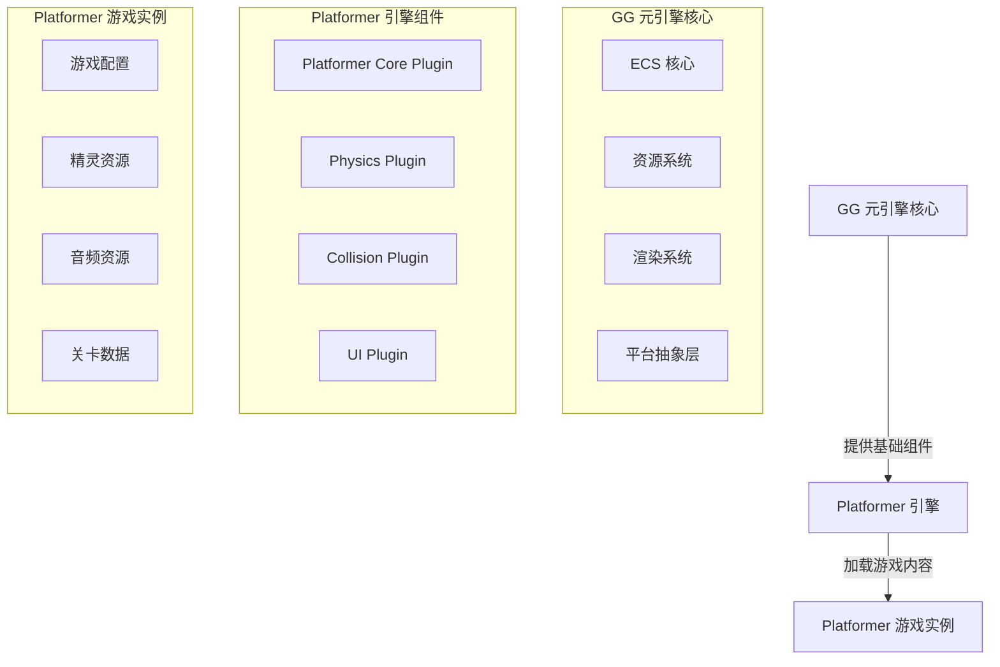

# Platformer 引擎架构设计

## 1. 架构概述

Platformer（平台跳跃）引擎是基于 GG 元引擎框架构建的具体游戏引擎，专注于平台跳跃游戏类型的开发。本架构设计文档详细说明了 Platformer 引擎的整体结构、核心组件和实现方案，特别是物理系统的设计。

## 2. 设计理念

Platformer 引擎遵循 GG 元引擎的设计理念，采用以下核心原则：

- **ECS 作为统一核心**：所有游戏逻辑通过 ECS 系统执行，确保性能和数据驱动
- **明确的语言分工**：Rust 负责引擎核心和平台交互，Valkyrie 负责游戏逻辑和内容
- **插件化架构**：通过插件组合机制实现功能扩展
- **平台抽象层**：屏蔽平台差异，提供统一接口
- **静态与动态分离**：编译时（Rust）生成具体引擎，运行时（Valkyrie）加载游戏内容
- **轻量级物理系统**：实现适合平台跳跃游戏的物理模拟
- **基于事件的设计**：使用事件系统实现游戏逻辑的解耦和模块化，采用 hook 思想处理游戏事件

## 3. 架构层次

Platformer 引擎架构分为以下层次：

1. **核心层**：基于 GG 元引擎的 ECS 核心、资源系统、渲染系统等
2. **引擎层**：Platformer 专用的组件、系统和插件，特别是物理系统
3. **游戏层**：具体的游戏内容和逻辑

## 4. 核心组件

### 4.1 实体组件（ECS）

#### 核心组件

- **Transform**：位置和旋转信息
- **Velocity**：速度和加速度
- **Sprite**：精灵渲染信息
- **Collider**：碰撞检测信息
- **Health**：生命值
- **Player**：玩家控制标记，包括事件（on_health_change、on_death、on_jump、on_land）
- **Platform**：平台标记
- **Collectible**：可收集物品标记
- **PhysicsBody**：物理体信息
- **GameState**：游戏状态组件，包括分数、生命、关卡和事件

#### 核心系统

- **InputSystem**：处理玩家输入
- **PhysicsSystem**：处理物理模拟和碰撞响应
- **MovementSystem**：处理实体移动
- **CollisionSystem**：处理碰撞检测
- **RenderSystem**：处理渲染逻辑
- **CollectibleSystem**：处理物品收集逻辑

### 4.2 插件系统

Platformer 引擎包含以下核心插件：

- **Platformer Core Plugin**：提供 Platformer 游戏的核心功能
- **Physics Plugin**：提供物理系统功能
- **Collision Plugin**：提供碰撞检测功能
- **UI Plugin**：提供游戏界面

### 4.3 资源管理

- **Sprite 资源**：游戏角色、平台、物品等精灵
- **Audio 资源**：音效和背景音乐
- **Level 资源**：关卡配置和地图数据

## 5. 架构图

## 6. 关键功能实现

### 6.1 物理系统

- **重力模拟**：实现基本的重力效果
- **碰撞检测**：实现精确的碰撞检测
- **碰撞响应**：实现碰撞后的物理响应
- **平台交互**：实现角色与平台的交互逻辑

### 6.2 玩家控制

- **输入处理**：通过 InputSystem 处理键盘、鼠标或游戏手柄输入
- **移动逻辑**：通过 MovementSystem 实现玩家角色的移动
- **跳跃逻辑**：实现角色的跳跃和空中控制

### 6.3 关卡设计

- **地图系统**：实现 2D 平台地图的加载和管理
- **平台系统**：实现不同类型的平台（静态、移动、易碎等）
- **物品系统**：实现可收集物品和道具

### 6.4 渲染系统

- **精灵渲染**：实现 2D 精灵的渲染
- **特效渲染**：实现跳跃、收集等特效
- **UI 渲染**：实现游戏界面的渲染

## 7. 物理系统设计

Platformer 引擎的物理系统是核心功能之一，设计如下：

### 7.1 物理组件

- **PhysicsBody**：包含质量、重力缩放、碰撞层等信息
- **Collider**：包含碰撞体形状（矩形、圆形等）和碰撞层

### 7.2 物理系统实现

- **重力计算**：根据重力加速度计算物体的垂直速度
- **碰撞检测**：使用轴对齐边界盒（AABB）进行碰撞检测
- **碰撞响应**：实现碰撞后的位置修正和速度变化
- **平台检测**：实现角色与平台的交互，包括站立、跳跃等

### 7.3 性能优化

- **空间分区**：使用网格或四叉树优化碰撞检测
- **碰撞过滤**：根据碰撞层过滤不必要的碰撞检测
- **批处理**：批量处理物理计算，提高性能

## 8. 与 GG 元引擎的集成

Platformer 引擎通过以下方式与 GG 元引擎集成：

- **插件注册**：通过 GG 元引擎的插件注册机制注册 Platformer 专用插件
- **ECS 集成**：使用 GG 元引擎的 ECS 系统管理游戏实体
- **资源系统集成**：使用 GG 元引擎的资源系统管理游戏资源
- **渲染系统集成**：使用 GG 元引擎的渲染系统进行图形渲染

## 9. 扩展性考虑

- **模块化设计**：核心功能模块化，便于后续扩展
- **插件机制**：通过插件机制支持功能扩展
- **配置系统**：通过配置文件支持游戏参数调整
- **脚本支持**：支持使用 Valkyrie 脚本实现游戏逻辑

## 10. 性能优化

- **ECS 优化**：使用 GG 元引擎的 ECS 系统实现高效的实体管理
- **物理优化**：优化物理计算，减少不必要的计算
- **渲染优化**：使用批处理等技术优化渲染性能
- **内存管理**：合理管理内存使用，避免内存泄漏

## 11. 示例游戏规划

Platformer 引擎的示例游戏将包含以下内容：

- **基本玩法**：玩家控制角色移动和跳跃，收集物品，到达终点
- **关卡设计**：包含多个关卡，难度逐渐增加
- **平台类型**：多种不同类型的平台，如静态平台、移动平台、易碎平台等
- **物品系统**：可收集物品，如金币、道具等
- **敌人系统**：简单的敌人 AI，增加游戏挑战性

## 12. 结论

Platformer 引擎架构设计基于 GG 元引擎框架，采用 ECS 系统和插件化架构，确保性能和可扩展性。特别是物理系统的设计，为平台跳跃游戏提供了必要的物理模拟能力。通过合理的组件设计和系统实现，Platformer 引擎将为开发者提供一个功能完善、性能高效的平台跳跃游戏开发平台。