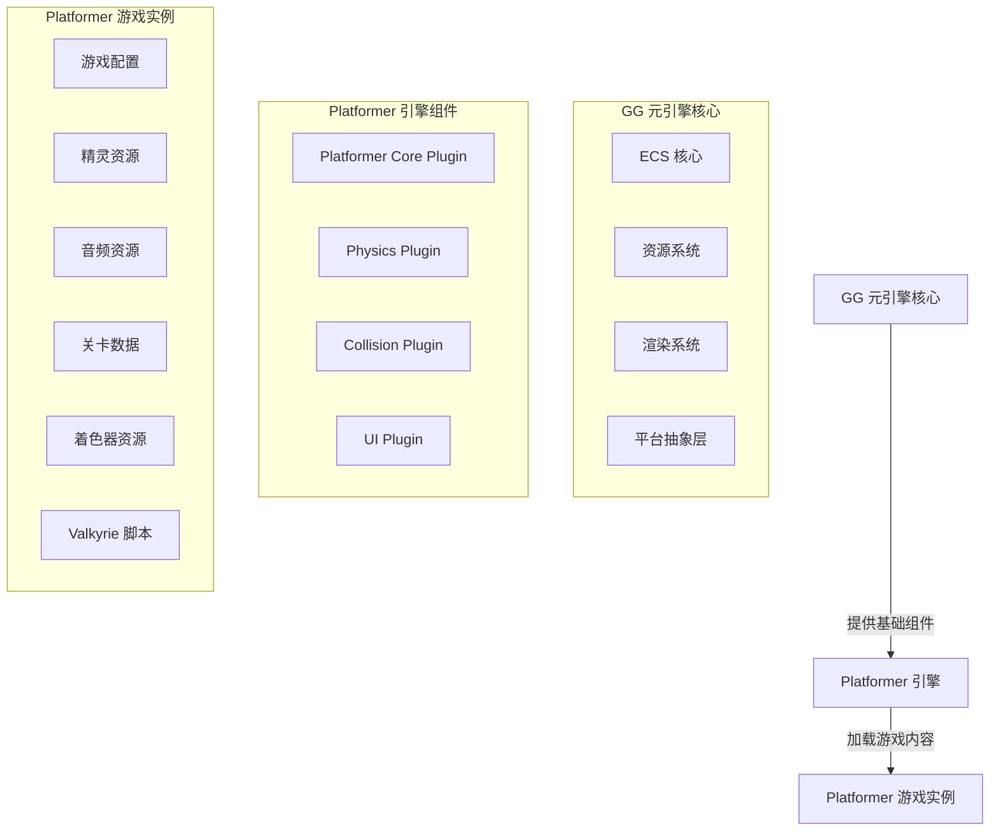

# Platformer 引擎架构设计

## 1. 架构概述

Platformer（平台跳跃）引擎是基于 GG 元引擎框架构建的具体游戏引擎，专注于平台跳跃游戏类型的开发。本架构设计文档详细说明了 Platformer 引擎的整体结构、核心组件和实现方案，特别是物理系统、碰撞检测和 AI 系统的设计。

## 2. 设计理念

Platformer 引擎遵循 GG 元引擎的设计理念，采用以下核心原则：

- **ECS 作为统一核心**：所有游戏逻辑通过 ECS 系统执行，确保性能和数据驱动
- **明确的语言分工**：Rust 负责引擎核心和平台交互，Valkyrie 负责游戏逻辑和内容
- **插件化架构**：通过插件组合机制实现功能扩展
- **平台抽象层**：屏蔽平台差异，提供统一接口
- **静态与动态分离**：编译时（Rust）生成具体引擎，运行时（Valkyrie）加载游戏内容
- **轻量级物理系统**：实现适合平台跳跃游戏的物理模拟，支持连续碰撞检测和物理材质
- **基于事件的设计**：使用事件系统实现游戏逻辑的解耦和模块化，采用 hook 思想处理游戏事件
- **多输入支持**：同时支持键盘和游戏手柄输入

## 3. 架构层次

Platformer 引擎架构分为以下层次：

1. **核心层**：基于 GG 元引擎的 ECS 核心、资源系统、渲染系统等
2. **引擎层**：Platformer 专用的组件、系统和插件，特别是物理系统
3. **游戏层**：具体的游戏内容和逻辑（Valkyrie 脚本驱动）

## 4. 核心组件

### 4.1 实体组件（ECS）

#### 核心组件

- **Transform**：位置和旋转信息
- **Velocity**：速度和加速度
- **Sprite**：精灵渲染信息
- **Collider**：碰撞检测信息（支持圆形和矩形，含碰撞层/掩码过滤）
- **PhysicsBody**：物理体信息（含 CCD 开关）
- **PhysicsMaterial**：物理材质（弹性系数 restitution、摩擦系数 friction）
- **Health**：生命值
- **Player**：玩家控制标记，支持二段跳、无敌状态
- **Platform**：平台标记，支持 8 种平台类型
- **Collectible**：可收集物品标记
- **Enemy**：敌人标记，含伤害值和踩踏弹跳力
- **AI**：敌人 AI 组件，支持 6 种行为模式
- **InputState**：输入状态资源，支持键盘和手柄

#### 平台类型

| 类型 | 说明 |
|------|------|
| Static | 静态平台 |
| Moving | 移动平台（往返运动） |
| Breakable | 易碎平台（踩踏后延迟销毁） |
| Disappearing | 消失平台（踩踏后淡出，定时重生） |
| Spring | 弹簧平台（落地时施加额外向上力） |
| Conveyor | 传送带平台（站在上面自动推动实体） |
| Ice | 冰面平台（降低摩擦系数产生滑行效果） |
| OneWay | 单向平台（仅从上方可站立） |

#### AI 行为模式

| 行为 | 说明 |
|------|------|
| Patrol | 巡逻（沿路径点移动） |
| Chase | 追踪（向玩家移动） |
| Attack | 攻击（近距离冲刺） |
| Evade | 躲避（低血量时远离玩家） |
| JumpAttack | 跳跃攻击（向玩家跳跃并发起攻击） |
| RangedAttack | 远程攻击（向玩家发射投射物） |

#### 核心系统

- **InputSystem**：处理玩家输入，支持键盘和游戏手柄
- **PhysicsSystem**：处理物理模拟，支持连续碰撞检测（CCD）和物理材质
- **CollisionSystem**：处理碰撞检测，使用空间哈希网格优化，支持碰撞层过滤
- **PlatformSystem**：处理平台行为，支持 8 种平台类型
- **AISystem**：处理敌人 AI，支持 6 种行为模式和路径寻找
- **CollectibleSystem**：处理物品收集逻辑
- **RenderSystem**：处理渲染逻辑，按实体类型分配不同颜色

### 4.2 着色器系统

Platformer 引擎使用 GG Shader（.gs）格式编写着色器：

- **PlatformerSprite.shader**：2D 精灵着色器，支持纹理采样、颜色 tint、水平/垂直翻转
- **PlatformerEffect.shader**：特效着色器，支持闪烁、淡入淡出、颜色叠加效果

### 4.3 UI 系统

游戏 HUD 使用 .prefab 格式定义：

- **game_hud.prefab**：包含血条（UiProgressBar）、分数文本（UiText）、生命数文本（UiText）

### 4.4 脚本系统

游戏逻辑使用 Valkyrie .script 格式编写：

- **Physics.script**：物理材质组件、弹簧力系统、冰面摩擦逻辑
- **Collision.script**：空间哈希优化系统、碰撞过滤逻辑
- **EnemyAI.script**：路径寻找系统、跳跃攻击和远程攻击行为
- **Input.script**：手柄输入系统、输入映射管理
- **Player.script**：玩家组件/系统/控制器
- **Enemy.script**：敌人组件/系统/控制器
- **GameState.script**：游戏状态组件/系统/管理器
- **Init.script**：初始化系统、碰撞系统、输入系统

### 4.5 插件系统

Platformer 引擎包含以下核心插件：

- **Platformer Core Plugin**：提供 Platformer 游戏的核心功能
- **Physics Plugin**：提供物理系统功能（含 CCD 和物理材质）
- **Collision Plugin**：提供碰撞检测功能（含空间哈希和层过滤）
- **UI Plugin**：提供游戏界面

### 4.6 资源管理

- **Sprite 资源**：游戏角色、平台、物品等精灵
- **Audio 资源**：音效和背景音乐
- **Level 资源**：关卡配置和地图数据
- **Shader 资源**：GG Shader 格式的着色器文件

## 5. 架构图

## 6. 关键功能实现

### 6.1 物理系统

- **重力模拟**：实现基本的重力效果，支持重力缩放
- **连续碰撞检测（CCD）**：当实体速度超过阈值时，使用多步扫掠检测防止穿透
- **物理材质**：不同平台可配置不同的弹性系数和摩擦系数
- **碰撞响应**：实现碰撞后的物理响应，考虑材质属性
- **平台交互**：实现角色与平台的交互逻辑

### 6.2 碰撞检测

- **空间哈希网格**：使用空间哈希网格优化碰撞检测，支持动态 cell_size 调整
- **碰撞层过滤**：在 broad phase 阶段根据 collision_layer 和 collision_mask 过滤
- **碰撞体类型**：支持 Circle-Circle、Rectangle-Rectangle、Circle-Rectangle 三种碰撞对
- **碰撞信息**：返回穿透深度、碰撞法线和碰撞点

### 6.3 玩家控制

- **输入处理**：通过 InputSystem 处理键盘和游戏手柄输入
- **移动逻辑**：支持键盘方向键/WASD 和手柄摇杆控制
- **跳跃逻辑**：实现二段跳、弹簧弹跳、无敌帧

### 6.4 敌人 AI

- **状态机**：6 种行为模式（巡逻/追踪/攻击/躲避/跳跃攻击/远程攻击）
- **路径寻找**：基于路点（waypoint）的导航系统
- **状态转换**：基于距离和生命值比例自动切换行为

### 6.5 关卡设计

- **地图系统**：实现 2D 平台地图的加载和管理
- **平台系统**：8 种不同类型的平台
- **物品系统**：可收集物品和道具

### 6.6 渲染系统

- **精灵渲染**：使用 PlatformerSprite.shader 实现 2D 精灵渲染
- **特效渲染**：使用 PlatformerEffect.shader 实现闪烁、淡入淡出
- **UI 渲染**：通过 game_hud.prefab 定义游戏 HUD
- **渲染管线**：DrawCommandBuffer → render_frame 消费 → UI 渲染 → 呈现

## 7. 物理系统设计

Platformer 引擎的物理系统是核心功能之一，设计如下：

### 7.1 物理组件

- **PhysicsBody**：包含质量、重力缩放、碰撞层、CCD 开关等信息
- **PhysicsMaterial**：包含弹性系数（restitution）和摩擦系数（friction）
- **Collider**：包含碰撞体形状（矩形、圆形）和碰撞层/掩码

### 7.2 物理系统实现

- **重力计算**：根据重力加速度计算物体的垂直速度
- **连续碰撞检测**：当 ccd_enabled 且速度超过阈值时，将一帧分为多步执行
- **物理材质应用**：碰撞响应考虑材质的弹性系数和摩擦系数
- **平台检测**：实现角色与平台的交互，包括站立、跳跃、弹簧弹跳等

### 7.3 性能优化

- **空间分区**：使用空间哈希网格优化碰撞检测，支持动态 cell_size
- **碰撞过滤**：根据碰撞层/掩码在 broad phase 阶段过滤不必要的碰撞检测
- **批处理**：批量处理物理计算，提高性能

## 8. 与 GG 元引擎的集成

Platformer 引擎通过以下方式与 GG 元引擎集成：

- **插件注册**：通过 GG 元引擎的插件注册机制注册 Platformer 专用插件
- **ECS 集成**：使用 GG 元引擎的 ECS 系统管理游戏实体
- **资源系统集成**：使用 GG 元引擎的资源系统管理游戏资源
- **渲染系统集成**：使用 GG 元引擎的渲染系统进行图形渲染
- **着色器集成**：使用 GG Shader 格式编写着色器，通过编译器编译为 GPU 着色器

## 9. 扩展性考虑

- **模块化设计**：核心功能模块化，便于后续扩展
- **插件机制**：通过插件机制支持功能扩展
- **配置系统**：通过配置文件支持游戏参数调整，含手柄按键映射
- **脚本支持**：支持使用 Valkyrie 脚本实现游戏逻辑
- **新平台类型**：可轻松添加新的平台类型到 PlatformType 枚举
- **新 AI 行为**：可轻松添加新的 AI 行为到 AIBehavior 枚举

## 10. 性能优化

- **ECS 优化**：使用 GG 元引擎的 ECS 系统实现高效的实体管理
- **物理优化**：CCD 仅在高速实体上启用，避免不必要的计算
- **碰撞优化**：空间哈希网格 + 碰撞层过滤，100+ 实体碰撞帧时间不超过 2ms
- **渲染优化**：DrawCommandBuffer 批量提交，按类型分配颜色减少状态切换
- **内存管理**：合理管理内存使用，避免内存泄漏

## 11. 示例游戏规划

Platformer 引擎的示例游戏将包含以下内容：

- **基本玩法**：玩家控制角色移动和跳跃，收集物品，到达终点
- **关卡设计**：包含多个关卡，难度逐渐增加
- **平台类型**：8 种不同类型的平台（静态、移动、易碎、消失、弹簧、传送带、冰面、单向）
- **物品系统**：可收集物品，如金币、道具等
- **敌人系统**：6 种 AI 行为模式，支持路径寻找和远程攻击

## 12. 结论

Platformer 引擎架构设计基于 GG 元引擎框架，采用 ECS 系统和插件化架构，确保性能和可扩展性。物理系统支持连续碰撞检测和物理材质，碰撞系统使用空间哈希网格优化，AI 系统支持 6 种行为模式和路径寻找。通过合理的组件设计和系统实现，Platformer 引擎将为开发者提供一个功能完善、性能高效的平台跳跃游戏开发平台。
