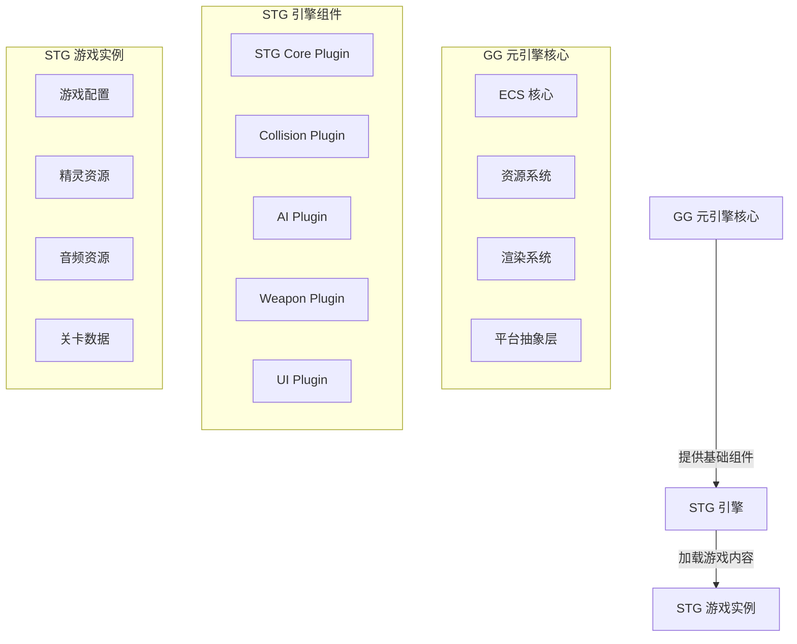

# STG 引擎架构设计

## 1. 架构概述

STG（Shoot 'em up）引擎是基于 GG 元引擎框架构建的具体游戏引擎，专注于射击游戏类型的开发。本架构设计文档详细说明了 STG 引擎的整体结构、核心组件和实现方案。

## 2. 设计理念

STG 引擎遵循 GG 元引擎的设计理念，采用以下核心原则：

- **ECS 作为统一核心**：所有游戏逻辑通过 ECS 系统执行，确保性能和数据驱动
- **插件化架构**：通过插件组合机制实现功能扩展
- **平台抽象层**：屏蔽平台差异，提供统一接口
- **静态与动态分离**：编译时生成具体引擎，运行时加载游戏内容
- **基于事件的设计**：使用事件系统实现游戏逻辑的解耦和模块化，采用 hook 思想处理游戏事件

## 3. 架构层次

STG 引擎架构分为以下层次：

1. **核心层**：基于 GG 元引擎的 ECS 核心、资源系统、渲染系统等
2. **引擎层**：STG 专用的组件、系统和插件
3. **游戏层**：具体的游戏内容和逻辑

## 4. 核心组件

### 4.1 实体组件（ECS）

#### 核心组件

- **Transform**：位置和旋转信息
- **Velocity**：速度和加速度
- **Sprite**：精灵渲染信息
- **Collider**：碰撞检测信息
- **Health**：生命值
- **Player**：玩家控制标记，包括事件（on_health_change、on_death、on_fire、on_hit）
- **Enemy**：敌人标记，包括事件（on_death、on_attack）
- **Bullet**：子弹标记
- **Weapon**：武器系统
- **GameState**：游戏状态组件，包括分数、生命、关卡、波次和事件

#### 核心系统

- **InputSystem**：处理玩家输入
- **MovementSystem**：处理实体移动
- **CollisionSystem**：处理碰撞检测和响应
- **WeaponSystem**：处理武器和射击逻辑
- **AISystem**：处理敌人 AI 行为
- **RenderSystem**：处理渲染逻辑

### 4.2 插件系统

STG 引擎包含以下核心插件：

- **STG Core Plugin**：提供 STG 游戏的核心功能
- **Collision Plugin**：提供碰撞检测功能
- **AI Plugin**：提供敌人 AI 行为
- **Weapon Plugin**：提供武器系统
- **UI Plugin**：提供游戏界面

### 4.3 资源管理

- **Sprite 资源**：游戏角色、敌人、子弹等精灵
- **Audio 资源**：音效和背景音乐
- **Level 资源**：关卡配置和敌人波次

## 5. 架构图

## 6. 关键功能实现

### 6.1 玩家控制

- **输入处理**：通过 InputSystem 处理键盘、鼠标或游戏手柄输入
- **移动逻辑**：通过 MovementSystem 实现玩家角色的移动
- **射击逻辑**：通过 WeaponSystem 实现武器切换和射击

### 6.2 敌人 AI

- **路径规划**：实现基本的敌人移动路径
- **攻击行为**：实现敌人的射击和攻击模式
- **波次管理**：实现敌人波次的生成和管理

### 6.3 碰撞检测

- **碰撞体**：实现不同类型的碰撞体（圆形、矩形等）
- **碰撞响应**：实现碰撞后的物理响应和游戏逻辑
- **性能优化**：使用空间分区等技术优化碰撞检测性能

### 6.4 渲染系统

- **精灵渲染**：实现 2D 精灵的渲染
- **特效渲染**：实现爆炸、子弹轨迹等特效
- **UI 渲染**：实现游戏界面的渲染

## 7. 与 GG 元引擎的集成

STG 引擎通过以下方式与 GG 元引擎集成：

- **插件注册**：通过 GG 元引擎的插件注册机制注册 STG 专用插件
- **ECS 集成**：使用 GG 元引擎的 ECS 系统管理游戏实体
- **资源系统集成**：使用 GG 元引擎的资源系统管理游戏资源
- **渲染系统集成**：使用 GG 元引擎的渲染系统进行图形渲染

## 8. 扩展性考虑

- **模块化设计**：核心功能模块化，便于后续扩展
- **插件机制**：通过插件机制支持功能扩展
- **配置系统**：通过配置文件支持游戏参数调整
- **脚本支持**：支持使用 Valkyrie 脚本实现游戏逻辑

## 9. 性能优化

- **ECS 优化**：使用 GG 元引擎的 ECS 系统实现高效的实体管理
- **渲染优化**：使用批处理等技术优化渲染性能
- **碰撞检测优化**：使用空间分区等技术优化碰撞检测性能
- **内存管理**：合理管理内存使用，避免内存泄漏

## 10. 示例游戏规划

STG 引擎的示例游戏将包含以下内容：

- **基本玩法**：玩家控制飞船移动和射击，消灭敌人
- **关卡设计**：包含多个关卡，难度逐渐增加
- **敌人类型**：多种不同类型的敌人，具有不同的行为模式
- **武器系统**：多种武器类型，可通过游戏内获取
- **计分系统**：记录玩家得分，支持最高分记录

## 11. 结论

STG 引擎架构设计基于 GG 元引擎框架，采用 ECS 系统和插件化架构，确保性能和可扩展性。通过合理的组件设计和系统实现，STG 引擎将为开发者提供一个功能完善、性能高效的射击游戏开发平台。