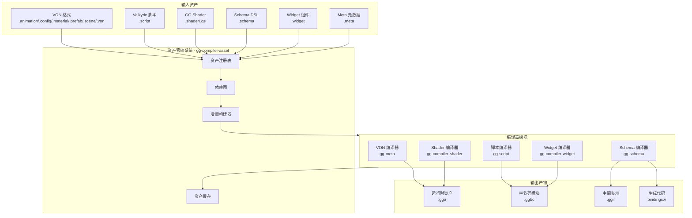
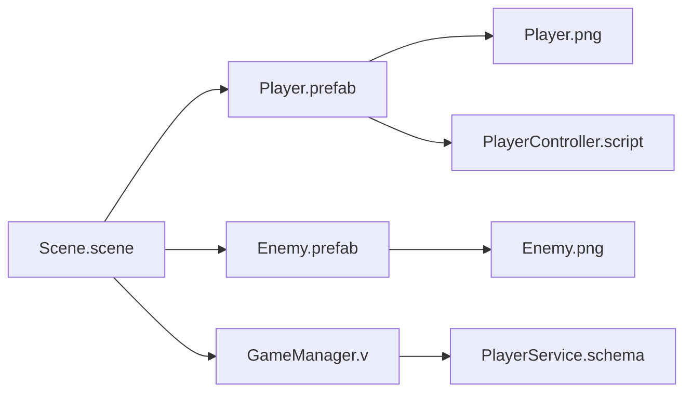
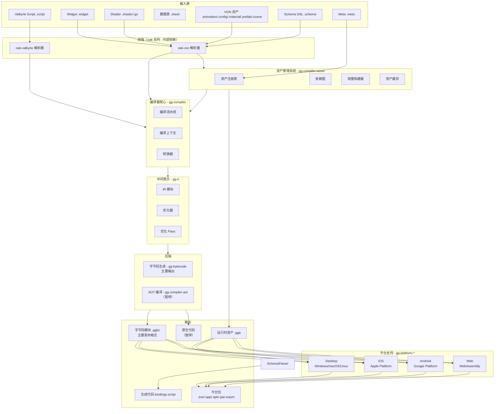

# GG Compiler 开发计划

## 项目概览

GG Compiler 是 GG 游戏引擎的编译器套件，负责将 Valkyrie 脚本、Shader、数据表等资源编译为可执行的字节码。编译管线采用模块化设计，支持多种输入格式和优化 Pass。

### 核心设计原则

1. **统一编译管线**：源码 → AST → IR → 字节码
2. **模块化架构**：编译器核心、转换器、优化 Pass 可插拔
3. **类型安全**：编译期类型检查，生成诊断信息
4. **增量编译**：支持增量编译，提高开发效率
5. **字节码优先**：定制化运行时 + 字节码是主要发布方式，性能优化持续进行
6. **资产管辖**：统一管理所有资源格式的编译和依赖

### 编译运行链路

```
Valkyrie Script → oak-valkyrie AST → ValkyrieCompiler → IrModule → 优化 Pass → BytecodeModule → VM
```

### 现有模块

| 模块                 | 路径                                     | 职责                                     |
| ------------------ | -------------------------------------- | -------------------------------------- |
| gg-compiler        | `projects/compiler/gg-compiler`         | 编译器核心框架（流水线、产物、上下文）                    |
| gg-compiler-script | `projects/compiler/gg-compiler-script` | 统一脚本编译器（.script/.widget/.shader）       |
| gg-compiler-aot    | `projects/compiler/gg-compiler-aot`    | AOT 原生编译器（暂停）                          |
| gg-compiler-asset  | `projects/compiler/gg-compiler-asset`  | 资产管辖系统（统一资源编译管道）                       |
| gg-compiler-script | `projects/compiler/gg-compiler-script` | Valkyrie 脚本编译器                         |
| gg-compiler-shader | `projects/compiler/gg-compiler-shader` | Shader 编译器                             |
| gg-sheet           | `projects/compiler/gg-sheet`           | 数据表编译器                                 |
| gg-meta            | `projects/core/gg-meta`                | VON 格式编译器（AST 由 oak-voc 提供）            |
| gg-schema          | `projects/compiler/gg-schema`          | Schema DSL 编译器（AST 由 oak-voc 提供）       |
| gg-compiler-widget | `projects/compiler/gg-compiler-widget` | Widget 编译器（AST 由 oak-voc 提供）           |
| gg-ir              | `projects/compiler/gg-ir`              | IR 中间表示和优化 Pass                        |
| gg-bytecode        | `projects/compiler/gg-bytecode`        | 字节码格式和解释器                              |

### 已迁移模块（原 platforms 目录）

| 模块                    | 原路径                                       | 当前路径                                        | 职责                            |
| --------------------- | ---------------------------------------- | ------------------------------------------- | ----------------------------- |
| gg-platform           | 新增                                       | `projects/compiler/gg-platform`             | 平台基础库（通用接口和工具）             |
| gg-platform-desktop   | ~~`projects/platforms/gg-platform-desktop`~~ | `projects/compiler/gg-platform-desktop`     | 桌面平台构建支持（Windows/macOS/Linux） |
| gg-platform-ios       | 从 gg-platform-mobile 拆分                      | `projects/compiler/gg-platform-ios`         | iOS 平台构建支持                  |
| gg-platform-android   | 从 gg-platform-mobile 拆分                      | `projects/compiler/gg-platform-android`     | Android 平台构建支持              |
| gg-platform-web       | ~~`projects/platforms/gg-platform-web`~~     | `projects/compiler/gg-platform-web`         | Web 平台构建支持（WebAssembly）       |

### 已迁移模块（原 runtime 目录）

| 模块           | 原路径                               | 当前路径                          | 职责               |
| ------------ | -------------------------------- | --------------------------- | ---------------- |
| gg-ir        | ~~`projects/runtime/gg-ir`~~     | `projects/compiler/gg-ir`   | IR 中间表示和优化 Pass |
| gg-bytecode  | ~~`projects/runtime/gg-bytecode`~~ | `projects/compiler/gg-bytecode` | 字节码格式和解释器       |

***

# Widget 编译组

- **负责模块**：gg-compiler-widget
- **大致进度**：85%
- **本月工作重点**：
  - 完善 oak-voc AST 接收接口（对接 oak-voc 解析器输出）
  - 实现 Template 完整语义分析（数据绑定验证、事件处理验证）
  - 完善 SCSS + Tailwind CSS 子集处理（嵌套规则、变量展开）
  - 支持组件导入导出（跨文件组件引用、依赖管理）
  - 实现响应式状态管理（Signal 系统集成）
- **已完成工作**：
  - ✅ Widget trait 重构（VxComponent 已合并到 Widget）
  - ✅ DirtyFlag 和 UsageHints 系统
  - ✅ 内置 Widget 组件实现
  - ✅ WidgetParser（template/script/style 三部分拆分）
  - ✅ TemplateIr 定义与 TemplateValidator
  - ✅ StyleIr 定义与 ScssProcessor/TailwindProcessor
  - ✅ WidgetArtifact 产物定义与 GGWT 序列化
  - ✅ WidgetTransformer 编译管线集成
  - ✅ ComponentRegistry（18 个内置组件注册）
- **长期目标**：
  - 完整的 Widget 编译系统
  - 响应式状态管理
  - 组件热重载
  - 完善的组件调试支持
- **相关文件**：
  - gg-compiler-widget: `projects/compiler/gg-compiler-widget/src/lib.rs`
  - gg-ui: `projects/core/gg-ui/src/widget.rs`

***

# STG 游戏支持（重点方向）

> **说明**：STG 游戏使用现有的 **Prefab + Script** 体系实现，无需独立的 STG 格式。

## STG 游戏资产结构

| 资产类型 | 格式 | 用途 |
| --- | --- | --- |
| 敌机 | .prefab | 定义敌机实体结构、组件配置 |
| 子弹 | .prefab | 定义子弹实体、碰撞体、渲染 |
| Boss | .prefab | 定义 Boss 实体、多阶段配置 |
| 弹幕脚本 | .script | 编写弹幕模式、发射逻辑 |
| 敌机 AI | .script | 编写敌机行为、移动模式 |
| Boss 战 | .script | 编写 Boss 阶段切换、技能序列 |
| 关卡 | .scene | 关卡场景、敌机生成点、事件触发 |
| 玩家 | .prefab + .script | 玩家实体、射击模式、炸弹效果 |

## 本月工作重点

- 设计 STG 游戏运行时组件架构（ECS 组件定义）
- 实现 BulletEmitter 弹幕发射器组件（发射模式、发射参数）
- 实现 BulletPattern 弹幕模式定义（圆形弹、扇形弹、追踪弹）
- 实现 EnemyAI 敌机行为组件（状态机、行为树）
- 实现 PathFollower 路径跟随组件（贝塞尔曲线、样条曲线）
- 实现 BossPhase Boss 阶段组件（阶段切换、技能序列）
- 实现碰撞检测优化（空间分区、碰撞层过滤）
- 创建 STG 游戏示例项目（基础弹幕演示）

## 长期目标

- 完整的 STG 游戏框架
- 可视化弹幕编辑器
- 弹幕预览和调试工具
- STG 游戏模板库

***

# 资产管辖系统

资产管辖系统（Asset Pipeline）是 GG Compiler 的核心子系统，负责统一管理所有资源格式的编译、依赖解析和增量构建。

## 支持的资产格式

| 格式        | 文件扩展名      | 格式类型      | 编译器模块             | 输出产物                |
| --------- | ---------- | --------- | ----------------- | ------------------- |
| Animation | .animation | VON       | gg-meta            | AnimationAsset      |
| Config    | .config    | VON       | gg-meta            | ConfigAsset         |
| Material  | .material  | VON       | gg-meta            | MaterialAsset       |
| Meta      | .meta      | VON       | gg-compiler-asset | MetaAsset           |
| Prefab    | .prefab    | VON       | gg-meta            | PrefabAsset         |
| Scene     | .scene     | VON       | gg-meta            | SceneAsset          |
| VON       | .von       | VON       | gg-meta            | VonAsset            |
| Schema    | .schema    | GG Schema | gg-schema         | SchemaIR + Bindings |
| Script    | .script    | Valkyrie  | gg-script         | BytecodeModule      |
| Shader    | .shader    | GG Shader | gg-compiler-shader         | ShaderSPIRV/WGSL    |
| Widget    | .widget    | GG Widget | gg-compiler-widget         | WidgetBytecode      |

## 资产编译流程



## 资产格式详细规范

### 1. VON 格式资产

VON（Valkyrie Object Notation）是 GG 引擎的核心数据序列化格式，用于存储动画、配置、材质、预制体、场景等资产。

#### 支持的 VON 资产类型

| 资产类型      | 文件扩展名      | 根结构           | 核心字段                                                         |
| --------- | ---------- | ------------- | ------------------------------------------------------------ |
| Animation | .animation | AnimationFile | animation, tracks, events, dependencies                      |
| Config    | .config    | ConfigFile    | config, settings, dependencies                               |
| Material  | .material  | MaterialFile  | material, properties, render\_states, dependencies           |
| Prefab    | .prefab    | PrefabFile    | prefab, entities, variants, dependencies                     |
| Scene     | .scene     | SceneFile     | scene, environment, entities, prefabs, scripts, dependencies |

#### VON 编译流程

```
.von 文件 → oak-voc 解析 → VON AST → 类型验证 → 资产对象 → 序列化 → .gga
```

#### VON 编译器职责

- 接收 oak-voc 提供的 VON AST
- 验证资产结构完整性
- 解析依赖关系（dependencies 字段）
- 验证 GUID 引用有效性
- 生成运行时资产对象
- 支持增量编译（基于 hash 字段）

### 2. Valkyrie 脚本资产

Valkyrie 脚本是 GG 引擎的核心脚本语言，用于游戏逻辑、组件定义、系统实现。

#### 脚本类型

| 类型              | 扩展名     | 用途     |
| --------------- | ------- | ------ |
| Valkyrie Script | .script | 游戏逻辑脚本 |

#### 脚本编译流程

```
.script 文件 → oak-valkyrie 解析 → AST → 类型检查 → IR 生成 → 优化 Pass → 字节码生成 → .ggbc
```

#### 脚本编译器职责

- 接收 oak-valkyrie 提供的 AST
- 类型检查和推断
- 支持 @main 多入口
- 支持 impl Trait for Type 语法
- 支持 @target 平台条件编译
- ORM 宿主函数绑定
- 生成 GG IR 和字节码

### 3. GG Shader 资产

GG Shader (gs) 是 GG 引擎的着色器语言，设计为易于人类阅读和机器分析。

#### Shader 类型

| 类型       | 关键字         | 用途        |
| -------- | ----------- | --------- |
| PBR      | by PBR      | 基于物理的渲染   |
| Unlit    | by Unlit    | 无光照渲染     |
| Phong    | by Phong    | 传统光照模型    |
| Compute  | by Compute  | 计算着色器     |
| UiUnlit  | by UiUnlit  | UI 基础渲染   |
| UiSdf    | by UiSdf    | SDF 文字渲染  |
| UiCustom | by UiCustom | 自定义 UI 特效 |

#### Shader 编译流程

```
.shader 文件 → oak-voc 解析 → Shader AST → 语义分析 → Naga IR → gfx 工作组处理跨平台编译
```

#### Shader 编译器职责

- 接收 oak-voc 提供的 Shader AST
- 验证着色器结构
- 解析 uniforms 和属性
- 处理 fallback 策略
- 生成 Naga IR 中间表示
- 支持变体系统

### 4. Schema DSL 资产

Schema DSL 是 GG 引擎的数据模型定义语言，用于后端服务、本地存储和 RPC 服务。

#### Schema 组成

| 组件      | 关键字     | 用途     |
| ------- | ------- | ------ |
| Model   | model   | 数据库实体表 |
| Enum    | enums   | 枚举类型   |
| Message | message | RPC 消息 |
| Service | service | RPC 服务 |

#### Schema 编译流程

```
.schema 文件 → oak-voc 解析 → Schema AST → 类型验证 → GG IR + Valkyrie 绑定 + 迁移文件
```

#### Schema 编译器职责

- 接收 oak-voc 提供的 Schema AST
- 验证数据模型定义
- 生成 GG IR 中间表示
- 生成 Valkyrie 类型绑定
- 生成数据库迁移文件
- 支持多数据库方言（SQLite、PostgreSQL、MySQL、Redis）

### 5. Widget 资产

Widget 是 GG Editor UI Toolkit 的组件格式，类似 Vue 单文件组件。

#### Widget 组成

| 部分       | 用途           |
| -------- | ------------ |
| template | ValkyrieX 模板 |
| script   | Valkyrie 脚本  |
| style    | USS 样式       |

#### Widget 编译流程

```
.widget 文件 → 解析三部分 → Template AST + Script AST + USS AST → 合并编译 → Widget 字节码 → .ggbc
```

#### Widget 编译器职责

- 解析 template 部分（ValkyrieX）
- 解析 script 部分（Valkyrie）
- 解析 style 部分（USS）
- 合并编译为 Widget 字节码
- 支持组件导入导出
- 支持响应式状态管理

### 6. Meta 资产

Meta 文件存储资产的元数据，包括 GUID、导入设置、依赖关系。

#### Meta 结构

| 字段               | 用途       |
| ---------------- | -------- |
| guid             | 全局唯一标识符  |
| type             | 资产类型     |
| import\_settings | 导入设置     |
| dependencies     | 依赖关系     |
| references       | 引用关系     |
| hash             | SHA1 哈希值 |

#### Meta 处理流程

```
.meta 文件 → TOML 解析 → Meta 对象 → 注册到资产注册表 → 更新依赖图
```

## 依赖管理系统

### 依赖图构建

资产管辖系统通过解析每个资产的 dependencies 字段构建依赖图：



### 循环依赖检测

资产管辖系统在构建依赖图时自动检测循环依赖：

```
Asset A → Asset B → Asset C → Asset A  // 检测到循环依赖，编译错误
```

### 增量编译

基于资产的 hash 字段实现增量编译：

```
1. 读取资产文件的 hash
2. 与缓存中的 hash 比较
3. 如果相同，跳过编译
4. 如果不同，重新编译并更新缓存
5. 检查依赖资产是否变化
6. 如果依赖变化，触发重新编译
```

## 资产注册表

资产注册表管理所有已编译资产的元数据和引用：

```rust
pub struct AssetRegistry {
    assets: HashMap<Guid, AssetEntry>,
    path_to_guid: HashMap<PathBuf, Guid>,
    dependency_graph: DependencyGraph,
}

pub struct AssetEntry {
    guid: Guid,
    path: PathBuf,
    asset_type: AssetType,
    hash: String,
    dependencies: Vec<Guid>,
    references: Vec<Guid>,
    compiled_artifact: Option<PathBuf>,
}
```

***

# 编译器核心组

- **负责模块**：gg-compiler, gg-ir, gg-bytecode
- **大致进度**：gg-compiler 90%，gg-ir 97%，gg-bytecode 99%
- **迁移状态**：✅ **已完成** - gg-ir 和 gg-bytecode 已从 runtime 目录迁移至 compiler 目录
- **本月工作重点**：
  - ✅ 循环不变量外提优化 Pass（LICM）
  - ✅ 循环展开优化 Pass（Loop Unrolling）
  - ✅ 逃逸分析 Pass（Escape Analysis）
  - ✅ 字节码解释器性能分析工具（Profiler）
  - ✅ 编译缓存管理完善（CompilationCache）
- **已完成工作**：
  - ✅ 编译流水线的 DAG 调度
  - ✅ 公共子表达式消除优化 Pass
  - ✅ 常量折叠、死代码消除、内联展开
  - ✅ 字节码调试信息范围查找（二分搜索）和变量名保留
  - ✅ IR 分区常量池序列化优化
  - ✅ 错误诊断格式化输出（代码片段、修复建议、级别排序）
  - ✅ 紧凑指令编码（变长操作数）
  - ✅ 解释器函数缓存和避免克隆优化
  - ✅ 尾调用优化（IR Pass + 解释器栈帧复用）
  - ✅ 优化 Pass 执行统计
  - ✅ DebugValue 与 BytecodeValue 对齐
  - ✅ 循环不变量外提（LICM）— 识别循环体内不变计算并外提到循环前置块
  - ✅ 循环展开（Loop Unrolling）— 对固定迭代次数的小循环进行展开优化
  - ✅ 逃逸分析（Escape Analysis）— 分析对象分配的逃逸状态，为栈分配优化提供基础
  - ✅ 字节码解释器性能分析器（Profiler）— 函数调用计数、耗时统计、热点识别、JSON 导出
  - ✅ 编译缓存管理（CompilationCache）— 内存缓存、依赖追踪、磁盘持久化、级联失效
- **长期目标**：
  - 完整的编译器基础设施
  - 丰富的优化 Pass 库
  - ✅ 支持增量编译
  - 完善的调试支持
  - 高性能字节码运行时
- **相关文件**：
  - gg-compiler: `projects/compiler/gg-compiler/src/lib.rs`
  - gg-compiler cache: `projects/compiler/gg-compiler/src/cache.rs`
  - gg-ir: `projects/compiler/gg-ir/src/lib.rs`
  - gg-ir LICM: `projects/compiler/gg-ir/src/loop_invariant.rs`
  - gg-ir LoopUnroll: `projects/compiler/gg-ir/src/loop_unroll.rs`
  - gg-ir EscapeAnalysis: `projects/compiler/gg-ir/src/escape_analysis.rs`
  - gg-bytecode: `projects/compiler/gg-bytecode/src/lib.rs`
  - gg-bytecode Profiler: `projects/compiler/gg-bytecode/src/profiler.rs`

***

# Valkyrie 编译组

- **负责模块**：gg-script, gg-compiler-script
- **大致进度**：gg-script 93%，gg-compiler-script 85%
- **本月工作重点**：
  - ✅ 完善类型推断系统（泛型类型推断、闭包类型推断）
  - 优化编译性能（增量编译、并行编译）
  - ✅ 支持更多语言特性（模式匹配增强）
  - ✅ 完善错误提示（类型错误定位、修复建议）
  - ✅ 改进编译器 API（更好的 IDE 集成支持）
- **已完成工作**：
  - ✅ 类型检查器
  - ✅ @main 多入口支持
  - ✅ impl Trait for Type 语法
  - ✅ ORM 宿主函数绑定
  - ✅ @target 平台条件编译
  - ✅ 完整的编译管线（源码 → AST → IR → 字节码）
  - ✅ 泛型类型参数推断（Array<Int>、Map<String, Int>）
  - ✅ 闭包类型推断（捕获变量类型推断）
  - ✅ 类型统一方法（unify_types）
  - ✅ 模式匹配增强（字面量模式、枚举变体模式、类解构）
  - ✅ 类型诊断修复建议（suggestion 字段）
  - ✅ 编译器 API 扩展（compile_with_diagnostics、check_only）
- **长期目标**：
  - 完整的 Valkyrie 语言支持
  - 渐进式类型系统
  - 全栈开发支持
  - 完善的语言服务器
- **相关文件**：
  - gg-script: `projects/compiler/gg-script/src/compiler.rs`
  - gg-compiler-script: `projects/compiler/gg-compiler-script/src/valkyrie_transformer.rs`

***

# Shader 编译组

- **负责模块**：gg-compiler-shader
- **大致进度**：70%
- **本月工作重点**：
  - 实现 Shader 变体系统（多 Pass、多特性组合）
  - 生成 Naga IR 中间表示（跨平台编译支持）
  - 完善 lower 模块（类型转换、语义映射）
  - 优化 Shader 编译性能（增量编译、缓存）
  - 支持 Shader 热重载（运行时更新）
- **已完成工作**：
  - ✅ GG Shader 语法
  - ✅ 基础编译
  - ✅ 内置函数
  - ✅ 序列化
- **长期目标**：
  - 完整的 Shader 语言
  - Naga IR 输出（跨平台编译由 gfx 工作组负责）
  - Shader 热重载
  - 可视化 Shader 编辑器支持
- **相关文件**：
  - gg-compiler-shader: `projects/compiler/gg-compiler-shader/src/compiler.rs`

***

# 数据表编译组

- **负责模块**：gg-sheet
- **大致进度**：80%
- **本月工作重点**：
  - 可视化表格编辑器原型
  - Color/Vector 类型结构化值解析
  - Map 类型结构化值解析
  - 缓存序列化格式加固
- **已完成工作**：
  - ✅ 数据表 Schema 定义
  - ✅ 数据验证规则
  - ✅ 多表合并
  - ✅ 类型安全的访问代码生成
  - ✅ VON 代码生成
  - ✅ 增量编译（基于文件哈希值 + 依赖感知）
  - ✅ 高级验证规则（跨表引用、自定义验证器 @custom）
  - ✅ 数据表延迟加载（大表按需加载，可配置阈值）
  - ✅ 多数据格式支持（Excel、CSV、TSV、JSON）
  - ✅ 数据迁移工具（AddField/RemoveField/RenameField/ChangeType）
  - ✅ 依赖拓扑排序（Kahn 算法 + 循环依赖检测）
  - ✅ 单表内引用完整性检查
  - ✅ CLI 命令入口（init/check/generate/watch）
  - ✅ Transformer 适配（接入编译流水线）
- **长期目标**：
  - 完整的数据表系统
  - 可视化表格编辑
  - Color/Vector/Map 结构化值解析
  - 缓存序列化格式加固
- **相关文件**：
  - gg-sheet: `projects/compiler/gg-sheet/src/compiler.rs`

***

# AOT 编译组（暂停）

> **状态**：暂停开发。AOT 编译技术难度较高，当前阶段无法投入足够的人力财力，待时机成熟再继续。

- **负责模块**：gg-compiler-aot
- **当前进度**：30%（暂停前）
- **已完成功能**：
  - 基础框架
  - Cranelift 集成
- **暂停原因**：
  - 技术难度高，需要专业编译器团队
  - 人力财力投入有限
  - 当前 VM 解释执行已满足大部分需求
- **恢复条件**：
  - 有足够的专业编译器人才
  - 有充足的研发预算
  - VM 性能确实成为瓶颈
- **相关文件**：
  - gg-compiler-aot: `projects/compiler/gg-compiler-aot/src/lib.rs`

***

# 平台支持组

- **负责模块**：gg-platform, gg-platform-desktop, gg-platform-ios, gg-platform-android, gg-platform-web
- **大致进度**：gg-platform 95%，gg-platform-desktop 95%，gg-platform-ios 85%，gg-platform-android 85%，gg-platform-web 85%
- **迁移状态**：✅ **已完成** - platforms 目录已迁移至 compiler 目录，且移动平台已拆分为 iOS 和 Android 独立模块
- **本月工作重点**：
  - 完善 iOS 平台构建流程（Xcode 项目生成、IPA 打包）
  - 完善 Android 平台构建流程（Gradle 项目生成、APK 打包）
  - 完善 Web 平台渲染后端检测（WebGL/WebGPU 自动选择、降级策略）
  - 实现桌面平台打包流程（Windows 安装包、macOS 代码签名、Linux AppImage）
  - 优化 Web 平台输出（WASM 优化、代码分割、PWA 支持）
  - 改进跨平台构建体验（统一构建命令、构建配置管理）
- **已完成工作**：
  - ✅ 模块迁移（platforms → compiler）
  - ✅ 创建 gg-platform 基础库
  - ✅ 将 gg-platform-mobile 拆分为 gg-platform-ios 和 gg-platform-android
  - ✅ Cargo.toml 依赖路径更新
  - ✅ 工作区配置更新
  - ✅ 迁移后编译验证
  - ✅ gg-core Platform trait 扩展（新增 list_devices、validate_environment 方法）
  - ✅ gg-core 新增 DeviceInfo、EnvironmentReport、ToolStatus 类型
  - ✅ gg-platform 新增 utils 模块（通用工具函数提取）
  - ✅ gg-platform 新增 build_profile 模块（构建配置管理）
  - ✅ gg-platform 新增 coordinator 模块（跨平台构建协调器 BuildCoordinator）
  - ✅ 桌面平台增强（macOS 代码签名、Windows NSIS 自定义、Linux AppImage 集成）
  - ✅ iOS 平台增强（Xcode 项目生成、签名管理、真机调试支持）
  - ✅ Android 平台增强（完整 Gradle 项目生成、签名配置、真机调试支持）
  - ✅ Web 平台增强（WASM 优化、PWA 缓存策略、GG Shader 编译管线集成）
  - ✅ iOS/Android 运行时模块迁移到 gg_core::platform trait 体系
- **长期目标**：
  - 完整的多平台构建支持
  - iOS/Android 打包流程
  - WebAssembly 优化输出
  - 跨平台代码生成
- **相关文件**：
  - gg-platform: `projects/compiler/gg-platform/src/lib.rs`
  - gg-platform-desktop: `projects/compiler/gg-platform-desktop/src/lib.rs`
  - gg-platform-ios: `projects/compiler/gg-platform-ios/src/lib.rs`
  - gg-platform-android: `projects/compiler/gg-platform-android/src/lib.rs`
  - gg-platform-web: `projects/compiler/gg-platform-web/src/lib.rs`

***

# 资产管辖组

- **负责模块**：gg-compiler-asset, gg-meta, gg-schema, gg-compiler-widget
- **大致进度**：gg-compiler-asset 50%，gg-meta 85%，gg-schema 60%，gg-compiler-widget 80%
- **本月工作重点**：
  - 完善资产注册表和依赖图（循环依赖检测、依赖更新）
  - 实现增量构建系统（基于文件哈希、依赖变更检测）
  - 支持所有资产格式（Animation、Config、Material、Prefab、Scene、VON、Schema、Script、Shader、Widget、Meta）
  - 优化资产加载性能（异步加载、优先级调度）
  - 完善资产缓存策略（内存缓存、磁盘缓存、缓存失效）
- **已完成工作**：
  - ✅ VON 格式编译器（AST 来自 oak-voc）
  - ✅ Widget 编译器（AST 来自 oak-voc）
  - ✅ 依赖图基础结构
  - ✅ 资产缓存
- **长期目标**：
  - 完整的资产管辖系统
  - 支持所有资产格式
  - 高效的增量编译
  - 完善的依赖管理
- **相关文件**：
  - gg-compiler-asset: `projects/compiler/gg-compiler-asset/src/lib.rs`
  - gg-meta: `projects/core/gg-meta/src/lib.rs`
  - gg-schema: `projects/compiler/gg-schema/src/lib.rs`
  - gg-compiler-widget: `projects/compiler/gg-compiler-widget/src/lib.rs`

***

## 模块完成度详细评估

### gg-compiler

- **完成度**：85%
- **已完成功能**：
  - 编译上下文
  - 产物管理
  - 转换器 trait
  - 流水线框架
  - 转换器适配器
  - 诊断格式化输出
- **进行中功能**：
  - DAG 调度
  - 增量编译
- **未完成功能**：
  - 缓存管理
  - 编译性能优化

### gg-script

- **完成度**：93%
- **已完成功能**：
  - Valkyrie AST 编译
  - IR 生成
  - 类型检查器
  - 字节码生成
  - ScriptCompiler 和 ScriptLoader
  - 目标平台支持
  - IR 优化集成
  - 泛型类型参数推断（Array<Int>、Map<String, Int>）
  - 闭包类型推断（捕获变量类型推断）
  - 类型统一方法（unify_types）
  - 模式匹配增强（字面量模式、枚举变体模式、类解构）
  - 类型诊断修复建议（suggestion 字段）
  - 编译器 API 扩展（compile_with_diagnostics、check_only）
- **未完成功能**：
  - 完整类型推断
  - 宏系统

### gg-ir

- **完成度**：93%
- **已完成功能**：
  - IR 结构定义（IrModule、IrFunction、IrValue、OpCode）
  - 常量折叠
  - 死代码消除
  - 内联展开
  - 公共子表达式消除
  - 序列化/反序列化
  - 目标平台支持
  - 入口点管理
  - 尾调用优化 Pass
  - Pass 执行统计
  - IR 分区常量池序列化
- **未完成功能**：
  - 高级优化 Pass
  - 循环优化

### gg-bytecode

- **完成度**：97%
- **已完成功能**：
  - 字节码格式
  - 解释器
  - 调试协议
  - 宿主接口
  - 调试信息
  - 读取器/写入器
  - 调试信息范围查找和变量名保留
  - 紧凑指令编码
  - 函数缓存优化
  - 尾调用栈帧复用
  - 解释器性能优化
  - 字节码体积优化
  - 常量池访问优化
- **未完成功能**：
  - 性能分析工具
  - 内存优化
  - JIT 编译（长期目标）

### gg-compiler-shader

- **完成度**：70%
- **已完成功能**：
  - Shader 解析
  - 基础编译
  - 内置函数
  - 变体系统
  - Lower 模块（类型转换）
  - 序列化
- **未完成功能**：
  - SPIR-V 输出
  - 优化 Pass

### gg-sheet

- **完成度**：65%
- **已完成功能**：
  - Schema 定义
  - 数据读取
  - 基础验证
  - 代码生成
  - 多表合并
  - 依赖管理
  - VON 代码生成
  - Transformer 集成
- **未完成功能**：
  - 增量编译
  - 高级验证规则

### gg-compiler-aot（暂停）

- **完成度**：30%（暂停前）
- **已完成功能**：
  - 基础框架
  - Cranelift 集成
- **暂停原因**：
  - 技术难度高
  - 人力财力有限
- **未完成功能**：
  - 完整后端
  - 多目标支持
  - 优化 Pass

### gg-platform

- **完成度**：85%
- **已完成功能**：
  - 平台通用接口定义
  - 文件系统接口
  - 输入接口
  - 平台接口
  - 运行时接口
  - 服务工厂接口
  - 线程接口
  - 时间接口
  - 窗口接口
- **未完成功能**：
  - 平台通用工具函数
  - 跨平台测试框架

### gg-platform-desktop

- **完成度**：80%
- **已完成功能**：
  - 文件系统实现
  - 输入系统实现
  - 窗口管理器
  - Platform trait 完整实现
  - 构建、打包、运行流程
  - 运行时平台实现
- **未完成功能**：
  - macOS 代码签名
  - Windows 安装包生成
  - Linux AppImage 打包

### gg-platform-ios

- **完成度**：65%
- **已完成功能**：
  - 文件系统实现
  - 输入系统实现
  - 生命周期管理
  - Platform trait 完整实现
  - 运行时平台实现
  - iOS 代码生成
  - IPA 打包流程
- **未完成功能**：
  - Xcode 项目生成优化
  - 真机调试支持
  - 签名和证书管理

### gg-platform-android

- **完成度**：65%
- **已完成功能**：
  - 文件系统实现
  - 输入系统实现
  - 生命周期管理
  - Platform trait 完整实现
  - 运行时平台实现
  - Android 代码生成
  - APK 打包流程
- **未完成功能**：
  - Gradle 项目生成优化
  - 真机调试支持
  - 签名和证书管理

### gg-platform-web

- **完成度**：65%
- **已完成功能**：
  - 文件系统实现
  - 输入系统实现
  - WebGL/WebGPU 检测
  - Platform trait 基础实现
  - 运行时平台实现
  - 渲染后端适配
- **未完成功能**：
  - WASM 优化输出
  - PWA 支持
  - Service Worker 集成
  - 压缩和代码分割

### gg-compiler-asset

- **完成度**：50%
- **已完成功能**：
  - 资产注册表基础
  - 依赖图基础结构
  - 增量构建框架
  - 资产缓存
  - Transformer 集成
- **未完成功能**：
  - 循环依赖检测
  - 完整的增量构建系统

### gg-meta

- **完成度**：85%
- **已完成功能**：
  - VON 词法分析
  - VON 语法分析
  - 基础资产类型支持
  - MetaFile 结构定义
  - MetaGenerator 自动生成
  - 类型验证
  - VonCompiler 实现
- **未完成功能**：
  - 完整类型验证
  - 增量编译支持

### gg-schema

- **完成度**：60%
- **已完成功能**：
  - Schema AST 处理（来自 oak-voc）
  - 基础类型系统
  - IR 定义
  - 代码生成框架
  - 验证器
  - Transformer 集成
- **未完成功能**：
  - GG IR 生成完善
  - Valkyrie 绑定生成
  - 迁移文件生成

### gg-compiler-widget

- **完成度**：80%
- **已完成功能**：
  - WidgetParser：template/script/style 三部分拆分
  - WidgetError：错误类型定义与 GError 转换
  - ComponentRegistry：18 个内置组件注册（8 基础 + 10 编辑器专用）
  - TemplateIr：ElementIr、DataBinding、EventBinding、ComponentDependency、PropertyValue
  - TemplateValidator：组件类型检查和属性验证
  - TemplateCodegen：TemplateBundle 代码生成
  - StyleIr：StyleRuleIr、SelectorIr、StyleValue、ResolvedValue
  - ScssProcessor：SCSS 子集处理（嵌套规则、变量、混入）
  - TailwindProcessor：Tailwind CSS 子集处理（工具类、响应式前缀、状态变体）
  - StyleCodegen：StyleBundle 代码生成
  - WidgetArtifact：GGWT 二进制序列化
  - WidgetTransformer：Transformer trait 实现（集成到编译流水线）
  - Widget trait 定义和实现
  - DirtyFlag 位标志系统
  - UsageHints GPU 优化提示
  - WidgetLifecycle 生命周期管理
  - DynamicWidget 动态组件支持
- **未完成功能**：
  - oak-voc AST 接收接口完善
  - Template 完整语义分析
  - 完整 USS 支持
  - 响应式系统支持

***

## 架构图



***

## IR 指令集

### 核心指令

| 指令                  | 说明       |
| ------------------- | -------- |
| `LoadConst(idx)`    | 从常量池加载常量 |
| `LoadNull`          | 加载 null 到栈顶 |
| `LoadTrue`          | 加载 true 到栈顶 |
| `LoadFalse`         | 加载 false 到栈顶 |
| `LoadLocal(idx)`    | 加载局部变量   |
| `StoreLocal(idx)`   | 存储局部变量   |
| `Add/Sub/Mul/Div`   | 算术运算     |
| `Mod`               | 取模运算     |
| `Neg`               | 取负运算     |
| `Eq/Ne/Lt/Le/Gt/Ge` | 比较运算     |
| `And/Or/Not`        | 逻辑运算     |
| `Jump(addr)`        | 无条件跳转    |
| `JumpIfFalse(addr)` | 条件跳转     |
| `JumpIfTrue(addr)`  | 条件跳转     |
| `Call(arity)`       | 函数调用     |
| `Return`            | 函数返回     |

### ECS 指令

| 指令                   | 说明   |
| -------------------- | ---- |
| `SpawnEntity`        | 创建实体 |
| `DespawnEntity`      | 销毁实体 |
| `AddComponent(type)` | 添加组件 |
| `GetComponent(type)` | 获取组件 |
| `SetComponent(type)` | 设置组件 |

### 对象和容器指令

| 指令                      | 说明     |
| ----------------------- | ------ |
| `GetField(idx)`         | 获取对象字段 |
| `SetField(idx)`         | 设置对象字段 |
| `GetIndex`              | 获取容器元素 |
| `SetIndex`              | 设置容器元素 |
| `NewObject(count)`      | 创建对象   |
| `NewList(count)`        | 创建列表   |
| `NewMap(count)`         | 创建映射   |
| `StringConcat(count)`   | 字符串拼接  |

### 宿主调用

| 指令                      | 说明     |
| ----------------------- | ------ |
| `HostCall(name, arity)` | 调用宿主函数 |

### 栈操作

| 指令      | 说明   |
| ------- | ---- |
| `Pop`   | 弹出栈顶 |
| `Dup`   | 复制栈顶 |

***

## 优化 Pass

### 已实现

| Pass              | 说明       |
| ----------------- | -------- |
| ConstantFold      | 常量折叠    |
| DeadCodeElim      | 死代码消除   |
| InlineExpansion   | 函数内联    |
| CommonSubexprElim | 公共子表达式消除 |
| TailCallOpt       | 尾调用优化    |

### 待实现

| Pass              | 说明       |
| ----------------- | -------- |
| LoopOptimization  | 循环优化    |
| EscapeAnalysis    | 逃逸分析     |

***

## 开发里程碑

### Phase 1: 核心完善 - ✅ 已完成

- [x] 完善 DAG 调度
- [x] 添加更多优化 Pass（公共子表达式消除）
- [x] 改进调试信息
- [x] 完善错误诊断
- [x] 字节码解释器性能基准测试

### Phase 2: 语言特性 - ✅ 已完成

- [x] 完善 @main 多入口
- [x] 实现 impl Trait for Type
- [x] 支持 @target 条件编译
- [x] 完善 ORM 绑定

### Phase 3: Shader 和数据表 - 进行中

- [ ] Shader 变体系统
- [ ] Naga IR 输出
- [x] 数据表合并
- [x] 代码生成

### Phase 4: 资产管辖系统 - 进行中

- [x] 完善资产注册表
- [ ] 实现增量构建
- [x] 完善依赖图
- [ ] 支持所有资产格式

### Phase 5: 平台模块迁移 - ✅ 已完成

- [x] 迁移 gg-platform-desktop 到 compiler 目录
- [x] 迁移 gg-platform-mobile 到 compiler 目录
- [x] 迁移 gg-platform-web 到 compiler 目录
- [x] 更新所有 Cargo.toml 依赖路径
- [x] 更新工作区 Cargo.toml
- [x] 验证迁移后编译通过
- [ ] 完善移动平台构建流程

### Phase 6: STG 游戏框架 - 进行中

- [ ] 设计 STG 游戏运行时框架
- [ ] 实现弹幕系统组件（BulletEmitter、BulletPattern）
- [ ] 实现敌机行为系统（EnemyAI、PathFollower）
- [ ] 实现 Boss 战系统（BossPhase、SkillSequence）
- [ ] 实现碰撞检测优化（空间分区、碰撞层）
- [ ] 创建 STG 游戏示例项目

### Phase 7: 性能优化 - 进行中

- [x] 字节码解释器优化
- [ ] IR 优化 Pass 增强
- [x] 常量池访问优化
- [x] 字节码体积压缩
- [ ] 性能分析工具

### Phase 8: AOT 编译（暂停）

> 技术难度高，当前阶段暂停开发

- [ ] 完善 Cranelift 后端
- [ ] x86\_64 目标支持
- [ ] WASM 目标支持

***

## 文档计划

### 技术文档

- [ ] 编译器架构文档
- [ ] IR 指令集参考
- [ ] 优化 Pass 开发指南
- [ ] 资产管辖系统文档
- [ ] 平台构建指南（Desktop/Mobile/Web）
- [ ] AOT 后端开发指南（暂停）

### 语言文档

- [ ] Valkyrie 语言规范
- [ ] GG Shader 语言规范
- [ ] 数据表 Schema 规范
- [ ] VON 格式规范
- [ ] Schema DSL 规范

***

## 发布计划

### 版本规划

- **v0.1.0**：基础编译管线
- **v0.2.0**：完整语言特性
- **v0.3.0**：Shader 和数据表
- **v0.4.0**：资产管辖系统
- **v0.5.0**：平台模块迁移完成
- **v0.6.0**：STG 游戏框架
- **v0.7.0**：性能优化
- **v0.8.0**：三平台构建支持（Desktop/Mobile/Web）
- **v1.0.0**：稳定版本（定制化运行时 + 字节码）
- **v1.x.0**：AOT 编译（待定，视资源情况）

### 发布方式

**主要发布方式**：定制化运行时 + 字节码

- 字节码格式稳定，跨平台兼容
- 定制化运行时针对不同平台优化
- 支持热更新和增量编译
- 性能持续优化中

### 发布标准

- 所有测试通过
- 代码覆盖率达到 80% 以上
- 编译性能达标
- 文档完善
