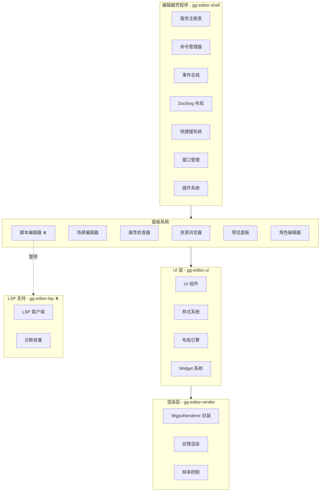

# GG Editor 开发计划

## 项目概览

GG Editor 是 GG 游戏引擎的可视化编辑器，采用微内核架构设计，提供面板系统、插件系统、命令系统、事件总线等基础设施。所有编辑器功能通过面板和插件扩展实现。

### 核心设计原则

1. **微内核架构**：编辑器壳程序只提供基础服务，所有功能通过插件扩展
2. **面板系统**：可拖拽、可停靠的面板布局系统
3. **服务注册**：统一的服务注册表，支持服务发现和依赖注入
4. **命令系统**：统一的命令管理，支持快捷键绑定
5. **事件驱动**：事件总线实现模块间解耦通信

### 现有模块

| 模块 | 路径 | 职责 | 状态 |
|------|------|------|------|
| gg-editor | `projects/editor/gg-editor` | 编辑器核心定义 | ⚠️ 已废弃 |
| gg-editor-shell | `projects/editor/gg-editor-shell` | 编辑器壳程序（微内核） | ✅ 开发中 |
| gg-editor-ui | `projects/editor/gg-editor-ui` | 编辑器 UI 组件和渲染 | ✅ 开发中 |
| gg-editor-render | `projects/editor/gg-editor-render` | 编辑器渲染后端 | ✅ 开发中 |
| gg-editor-asset-browser | `projects/editor/gg-editor-asset-browser` | 资源浏览器面板 | ✅ 开发中 |
| gg-editor-scene | `projects/editor/gg-editor-scene` | 场景编辑面板 | ✅ 开发中 |
| gg-editor-inspector | `projects/editor/gg-editor-inspector` | 属性检查器面板 | ✅ 开发中 |
| gg-editor-script | `projects/editor/gg-editor-script` | 脚本编辑面板 | ⏸️ 暂停 |
| gg-editor-preview | `projects/editor/gg-editor-preview` | 预览面板（HMR） | ✅ 开发中 |
| gg-editor-character | `projects/editor/gg-editor-character` | 角色编辑面板 | ✅ 开发中 |
| gg-editor-lsp | `projects/editor/gg-editor-lsp` | LSP 客户端 | ⏸️ 暂停 |

---

# 编辑器核心组

- **负责模块**：gg-editor, gg-editor-shell
- **大致进度**：gg-editor-shell 90%，gg-editor 已废弃
- **本月工作重点**：
  - 实现插件动态加载功能（.so/.dll 动态库加载）
  - 完善多窗口渲染集成
  - 优化编辑器启动性能
  - 完善扩展 API
- **长期目标**：
  - 实现完整的微内核架构
  - 支持插件热加载/卸载
  - 提供完善的扩展 API
  - 支持多窗口编辑器
- **相关文件**：
  - gg-editor-shell: `projects/editor/gg-editor-shell/src/lib.rs`
  - gg-editor-shell: `projects/editor/gg-editor-shell/src/shell.rs`
  - gg-editor-shell: `projects/editor/gg-editor-shell/src/service.rs`
  - gg-editor-shell: `projects/editor/gg-editor-shell/src/command.rs`
  - gg-editor-shell: `projects/editor/gg-editor-shell/src/event.rs`
  - gg-editor-shell: `projects/editor/gg-editor-shell/src/docking.rs`
  - gg-editor-shell: `projects/editor/gg-editor-shell/src/panel.rs`
  - gg-editor-shell: `projects/editor/gg-editor-shell/src/plugin.rs`

---

# 编辑器 UI 组

- **负责模块**：gg-editor-ui, gg-editor-render
- **大致进度**：gg-editor-ui 85%，gg-editor-render 95%
- **本月工作重点**：
  - 添加更多 UI 组件（下拉菜单、对话框、工具提示等）
  - 优化文本渲染性能（文本缓存、字体子像素渲染）
  - 完善编辑器 UI 组件库
- **已完成工作**：
  - ✅ Widget trait 重构（VxComponent 已合并到 Widget）
  - ✅ gg-ui 核心模块重构
  - ✅ gg-editor-ui 依赖更新
  - ✅ 主题系统（支持亮色/暗色主题切换）
  - ✅ 高 DPI 支持（自动检测和缩放）
  - ✅ ComponentRegistry（18 个内置组件注册）
  - ✅ 场景渲染到纹理支持
  - ✅ 帧率控制和渲染流程封装
  - ✅ WgpuRenderer 封装
  - Widget trait 定义和实现
  - DirtyFlag 位标志系统
  - UsageHints GPU 优化提示
  - 文本渲染引擎
  - Uber-Shader 模块
  - 内置组件：Layout、Stack、Button、Text、Input、Image、Panel、ScrollView
  - 编辑器组件：InspectorPanel、HierarchyView、AssetBrowser、SceneView、Toolbar、MenuBar、TabContainer、SplitView、TreeView、PropertyField
- **长期目标**：
  - 完整的编辑器 UI 组件库
  - 支持自定义主题
  - 高性能渲染管线
  - 无障碍访问支持
- **相关文件**：
  - gg-editor-ui: `projects/editor/gg-editor-ui/src/lib.rs`
  - gg-editor-ui: `projects/editor/gg-editor-ui/src/components.rs`
  - gg-editor-ui: `projects/editor/gg-editor-ui/src/layout/mod.rs`
  - gg-editor-ui: `projects/editor/gg-editor-ui/src/styles.rs`
  - gg-editor-render: `projects/editor/gg-editor-render/src/lib.rs`
  - gg-ui: `projects/core/gg-ui/src/widget.rs`

---

# 面板开发组

- **负责模块**：gg-editor-asset-browser, gg-editor-scene, gg-editor-inspector
- **大致进度**：gg-editor-asset-browser 80%，gg-editor-scene 80%，gg-editor-inspector 75%
- **本月工作重点**：
  - 完善资源浏览器的高级功能（批量操作、资源预览）
  - 增强场景编辑器的高级编辑功能
  - 扩展 Inspector 支持更多属性类型
  - 优化面板间的拖拽交互
- **长期目标**：
  - 完整的资源管理功能
  - 可视化场景编辑
  - 类型感知的属性编辑
  - 支持自定义属性编辑器
- **相关文件**：
  - gg-editor-asset-browser: `projects/editor/gg-editor-asset-browser/src/lib.rs`
  - gg-editor-scene: `projects/editor/gg-editor-scene/src/lib.rs`
  - gg-editor-inspector: `projects/editor/gg-editor-inspector/src/lib.rs`

---

# 脚本编辑组

- **负责模块**：gg-editor-script, gg-editor-lsp
- **大致进度**：gg-editor-script 30%，gg-editor-lsp 25%
- **当前状态**：**完全暂停** - 后续开发
- **工作重点**：
  - ⏸️ 脚本编辑：直接打开外部 IDE（VS Code 等），不自研编辑器
  - ⏸️ LSP：必须自研以与系统深度集成，但暂缓开发
- **长期目标**：
  - 自研 LSP 服务端（必须，用于系统协同）
  - 外部 IDE 集成（打开文件、跳转定义）
- **不考虑**：
  - ~~内置代码编辑器~~ - 直接用外部 IDE
  - ~~可视化脚本/蓝图~~ - AI 时代不需要
- **相关文件**：
  - gg-editor-script: `projects/editor/gg-editor-script/src/panel.rs`
  - gg-editor-lsp: `projects/editor/gg-editor-lsp/src/client.rs`

---

# 预览与调试组

- **负责模块**：gg-editor-preview, gg-editor-character
- **大致进度**：gg-editor-preview 35%，gg-editor-character 35%
- **本月工作重点**：
  - 实现预览面板的完整框架（游戏运行、暂停、停止控制）
  - 实现游戏预览功能（场景渲染、游戏逻辑执行）
  - 实现 HMR 热更新集成（脚本、资源热重载）
  - 实现角色编辑器基础功能（角色创建、骨骼绑定）
  - 添加动画预览功能（动画播放、暂停、调速）
- **长期目标**：
  - 完整的游戏预览和调试
  - 支持断点调试
  - 角色动画编辑
  - 性能分析工具
- **相关文件**：
  - gg-editor-preview: `projects/editor/gg-editor-preview/src/lib.rs`
  - gg-editor-character: `projects/editor/gg-editor-character/src/lib.rs`

---

## 模块完成度详细评估

### gg-editor
- **完成度**：已废弃
- **状态**：⚠️ **已废弃** - 迁移至 gg-editor-shell
- **说明**：该模块已被废弃，所有功能已迁移至 gg-editor-shell

### gg-editor-shell
- **完成度**：90%
- **已完成功能**：
  - 服务注册表（支持工厂函数、依赖注入、循环依赖检测）
  - 命令管理器（支持撤销/重做）
  - 事件总线（支持订阅/发布/批量处理）
  - 面板注册和管理
  - Docking 布局系统（支持序列化/反序列化、拖拽调整）
  - 快捷键系统
  - 完整的事件循环
  - 窗口管理（WinitWindowService）
  - UI 树管理
  - 插件系统（支持拓扑排序激活、依赖管理、热重载）
- **未完成功能**：
  - 插件动态加载（.so/.dll 动态库加载）
  - 多窗口渲染集成

### gg-editor-ui

- **完成度**：85%
- **已完成功能**：
  - 基础 UI 组件
  - 样式系统
  - Flexbox 布局引擎
  - Widget trait 集成
  - DirtyFlag 系统
  - UsageHints 系统
  - 主题系统（支持亮色/暗色主题）
  - DPI 管理（高 DPI 支持）
  - 文本渲染引擎
  - Uber-Shader 模块
  - 组件注册表（18 个内置组件）
- **未完成功能**：
  - 完整组件库（下拉菜单、对话框等高级组件）

### gg-editor-render
- **完成度**：95%
- **已完成功能**：
  - 场景渲染到纹理支持
  - 帧率控制和渲染流程封装
  - WgpuRenderer 封装
- **未完成功能**：
  - 更复杂的渲染特性
  - 性能优化

### gg-editor-scene
- **完成度**：80%
- **已完成功能**：
  - 基础场景编辑结构
  - 视口交互功能
  - 实体选择（支持点击选中、框选）
  - 变换工具（支持移动/旋转/缩放）
  - 场景导航（支持中键平移、滚轮缩放）
  - 网格显示（自适应间距）
  - 框选功能
  - 拖拽资源创建实体
  - 聚焦选中实体（F 键）
- **未完成功能**：
  - 更高级的场景编辑功能

### gg-editor-inspector
- **完成度**：75%
- **已完成功能**：
  - 属性描述符系统
  - 基础控件
  - 双向绑定
  - 自定义编辑器（9 种编辑器类型）
  - 数组/映射编辑
  - 命令系统集成（撤销/重做）
  - 拖拽资源设置属性
  - 组件折叠功能
- **未完成功能**：
  - 更多类型属性支持

### gg-editor-asset-browser
- **完成度**：80%
- **已完成功能**：
  - 基础资源浏览器面板定义
  - 目录树浏览
  - 文件系统集成
  - 文件操作功能（重命名、删除、移动、复制、导入）
  - 搜索过滤功能
  - 拖拽支持
  - 右键上下文菜单
  - 资源类型识别
- **未完成功能**：
  - 更完善的资源管理功能

### gg-editor-preview
- **完成度**：35%
- **已完成功能**：
  - 预览面板基本框架
- **未完成功能**：
  - 完整的场景预览功能
  - HMR 热更新集成
  - 调试功能

### gg-editor-character
- **完成度**：35%
- **已完成功能**：
  - 角色编辑面板基本结构
- **未完成功能**：
  - 骨骼编辑
  - 动画编辑
  - 属性编辑

### gg-editor-lsp
- **完成度**：25%
- **状态**：⏸️ **完全暂停** - 后续自研
- **已完成功能**：
  - LSP 客户端框架
  - 基础类型定义
- **未完成功能**：
  - 完整 LSP 协议支持
  - 诊断收集
  - 代码补全
- **策略**：必须自研，用于与引擎系统深度协同

---

## 架构图

---

## 开发里程碑

### Phase 1: 核心完善 (Week 1-2)

- [x] 完善服务注册表基础功能
- [x] 实现命令管理器
- [x] 实现事件总线
- [x] 实现 Docking 布局系统
- [x] 实现快捷键系统
- [x] 完善服务注册表依赖注入
- [x] 实现命令撤销/重做
- [x] 完善事件总线过滤机制
- [x] 实现布局持久化

### Phase 2: 面板功能 (Week 3-4)

- [x] 基础面板框架实现
- [x] UI 组件库基础实现
- [x] Widget 系统重构
- [x] 渲染器封装
- [x] 资源浏览器文件操作
- [x] 场景编辑器实体选择
- [x] Inspector 属性编辑
- [x] 拖拽支持

### Phase 3: 脚本编辑 - ⏸️ 完全暂停

- [ ] ⏸️ 脚本编辑：直接打开外部 IDE，不自研
- [ ] ⏸️ LSP：自研服务端，暂缓开发

> **策略调整**：
> - 内置编辑器完全放弃，直接调用外部 IDE
> - LSP 必须自研以与引擎系统深度协同
> - 不考虑可视化脚本/蓝图

### Phase 4: 高级特性 (Week 7-8)

- [ ] HMR 热更新
- [ ] 调试功能
- [ ] 性能优化
- [ ] 多窗口支持
- [ ] 插件热加载

---

## 文档计划

### 技术文档

- [ ] 编辑器架构文档
- [ ] 面板开发指南
- [ ] 插件开发指南
- [ ] API 参考文档

### 用户文档

- [ ] 编辑器使用指南
- [ ] 快捷键参考
- [ ] 面板功能说明

---

## 发布计划

### 版本规划

- **v0.1.0**：基础编辑器框架
- **v0.2.0**：核心面板功能
- **v0.3.0**：脚本编辑支持
- **v0.4.0**：调试和预览
- **v1.0.0**：稳定版本

### 发布标准

- 所有测试通过
- 代码覆盖率达到 70% 以上
- API 文档完善
- 性能达到 60fps
