# GG Runtime 开发计划

## 项目概览

GG Runtime 是 GG 游戏引擎的运行时系统，提供游戏循环、脚本执行、渲染后端、音频后端、网络通信、数据存储等核心运行时能力。运行时采用模块化设计，支持动态后端切换和热更新。

### 核心设计原则

1. **脚本驱动**：游戏逻辑由 Valkyrie 脚本驱动，运行时提供宿主环境
2. **模块化架构**：渲染、音频、网络、存储等后端可插拔替换
3. **跨平台兼容**：支持 Desktop、Mobile、Web 三大平台
4. **热更新支持**：HMR 热模块替换，支持脚本和资产热更新
5. **ECS 架构**：基于 ECS 的游戏世界管理

### 运行时架构

```
┌─────────────────────────────────────────────────────────────┐
│                        Runtime Core                          │
│  ┌─────────┐  ┌─────────┐  ┌─────────┐  ┌─────────────────┐ │
│  │ Script  │  │  Stage  │  │   HMR   │  │ ComponentRegistry│ │
│  │ Engine  │  │Scheduler│  │ Manager │  │                 │ │
│  └────┬────┘  └────┬────┘  └────┬────┘  └────────┬────────┘ │
│       │            │            │                │          │
│       └────────────┴────────────┴────────────────┘          │
│                            │                                 │
│                      ┌─────┴─────┐                          │
│                      │ EngineHost │                          │
│                      │  (ECS)    │                          │
│                      └─────┬─────┘                          │
└────────────────────────────┼────────────────────────────────┘
                             │
    ┌────────────────────────┼────────────────────────┐
    │                        │                        │
┌───┴───┐              ┌─────┴─────┐            ┌─────┴─────┐
│  VM   │              │  Renderer │            │   Audio   │
│       │              │  Backend  │            │  Backend  │
└───────┘              └───────────┘            └───────────┘
```

### 现有模块

| 模块 | 路径 | 职责 |
| --- | --- | --- |
| gg-runtime | `projects/runtime/gg-runtime` | 运行时核心（游戏循环、脚本引擎、HMR） |
| gg-vm | `projects/runtime/gg-vm` | 字节码虚拟机（脚本执行） |
| gg-render-wgpu | `projects/runtime/gg-render-wgpu` | WGPU 渲染后端（跨平台 2D 渲染） |
| gg-render-html | `projects/runtime/gg-render-html` | HTML 渲染后端（将 widget.md 编译成 html + wasm） |
| gg-runtime-audio | `projects/runtime/gg-runtime-audio` | 音频运行时（音频 HAL 和后端） |
| gg-runtime-ui | `projects/runtime/gg-runtime-ui` | UI 运行时（Widget 组件体系） |
| gg-runtime-cache | `projects/runtime/gg-runtime-cache` | 缓存模块（缓存驱动抽象） |
| gg-runtime-database | `projects/runtime/gg-runtime-database` | 数据库模块（数据库驱动抽象） |
| gg-runtime-net | `projects/runtime/gg-runtime-net` | 网络模块（TCP/WebSocket/HTTP） |
| gg-runtime-orm | `projects/runtime/gg-runtime-orm` | ORM 模块（Repository 模式） |

***

# 运行时核心组

- **负责模块**：gg-runtime, gg-vm
- **大致进度**：gg-runtime 88%，gg-vm 92%
- **本月工作重点**：
  - 完善 HMR 热更新机制（脚本热重载、资产热更新）
  - 优化游戏循环性能（帧时间稳定性、内存分配优化）
  - 完善调试协议支持（断点、变量监视、调用栈）
  - 优化脚本执行性能（指令缓存、热点检测）
  - 完善错误处理和诊断（错误堆栈、源码映射）
  - 实现多线程调度优化（并行系统执行）
- **已完成工作**：
  - ✅ Runtime 游戏循环
  - ✅ ScriptEngine 脚本引擎
  - ✅ EngineHost ECS 宿主
  - ✅ StageScheduler 阶段调度器
  - ✅ ComponentRegistry 组件注册表
  - ✅ HmrManager 热更新管理器
  - ✅ DeltaTimer 帧间隔计时器
  - ✅ FrameLimiter 帧率限制器
  - ✅ Vm 字节码虚拟机
  - ✅ VmDebugger 调试器
  - ✅ AttachedRuntime 附着式运行时
  - ✅ DebugWire 调试通信协议
  - ✅ PluginManager 插件管理器
- **长期目标**：
  - 完善的运行时基础设施
  - 高性能脚本执行
  - 完整的调试支持
  - 稳定的热更新机制
- **相关文件**：
  - gg-runtime: `projects/runtime/gg-runtime/src/lib.rs`
  - gg-vm: `projects/runtime/gg-vm/src/lib.rs`

***

# 渲染后端组

- **负责模块**：gg-render-wgpu, gg-render-html
- **大致进度**：gg-render-wgpu 78%，gg-render-html 65%
- **本月工作重点**：
  - 完善 WGPU 渲染管线（多 Pass 渲染、渲染目标管理）
  - 优化精灵批渲染性能（动态批处理、纹理图集）
  - 完善文本渲染（SDF 字体、CJK 支持）
  - 完善 HTML 渲染后端（将 widget.md 编译成 html + wasm）
  - 支持更多渲染特性（后处理、自定义着色器）
  - 实现渲染性能分析工具
- **已完成工作**：
  - ✅ WgpuRenderer WGPU 渲染器
  - ✅ SpriteBatch 精灵批渲染
  - ✅ GlyphAtlas 字形纹理图集
  - ✅ GlyphCache 字形缓存
  - ✅ TextureCache 纹理缓存
  - ✅ UniformPool Uniform 缓冲区池
  - ✅ HtmlRenderer HTML 渲染器
  - ✅ FontManager 字体管理器
  - ✅ HtmlRenderTarget 渲染目标
  - ✅ 裁剪矩形支持
- **长期目标**：
  - 高性能跨平台渲染
  - 完整的 2D 渲染能力
  - 编辑器 HTML 渲染优化
  - 支持自定义着色器
- **相关文件**：
  - gg-render-wgpu: `projects/runtime/gg-render-wgpu/src/lib.rs`
  - gg-render-html: `projects/runtime/gg-render-html/src/lib.rs`

***

# 音频运行时组

- **负责模块**：gg-runtime-audio
- **大致进度**：72%
- **本月工作重点**：
  - 完善音频命令系统（播放、暂停、停止、音量控制）
  - 优化音频混合性能（多声道混合、音频流处理）
  - 完善 Web Audio API 后端（浏览器兼容性、音频上下文管理）
  - 支持更多音频格式（OGG、MP3、FLAC 解码）
  - 添加音效和音乐分组（音量组、静音组、优先级）
  - 实现音频效果器（混响、低通滤波、音高变化）
- **已完成工作**：
  - ✅ AudioEngine trait 音频引擎抽象
  - ✅ AudioContext 音频上下文
  - ✅ AudioCommand 音频命令
  - ✅ SoundDescriptor 声音描述
  - ✅ SoundId 声音标识
  - ✅ SoundFormat 音频格式
  - ✅ CpalAudioEngine cpal 后端
  - ✅ WebAudioEngine Web Audio 后端
- **长期目标**：
  - 完整的音频系统
  - 多平台音频支持
  - 3D 空间音频
  - 音频效果器
- **相关文件**：
  - gg-runtime-audio: `projects/runtime/gg-runtime-audio/src/lib.rs`

***

# UI 运行时组

- **负责模块**：gg-runtime-ui
- **大致进度**：82%
- **本月工作重点**：
  - 完善响应式状态管理（Signal 系统、依赖追踪）
  - 优化布局系统性能（增量布局、布局缓存）
  - 完善事件处理机制（事件冒泡、事件捕获）
  - 支持更多内置组件（滚动视图、列表视图、网格视图）
  - 完善样式处理（样式继承、样式优先级）
  - 实现无障碍支持（屏幕阅读器、键盘导航）
- **已完成工作**：
  - ✅ Widget 组件体系（重导出自 gg-ui）
  - ✅ DirtyFlag 脏标记系统
  - ✅ UsageHints GPU 优化提示
  - ✅ WidgetLifecycle 生命周期
  - ✅ DynamicWidget 动态组件
  - ✅ Signal 响应式信号
  - ✅ GuiRendererAdapter 渲染器适配
  - ✅ UI 插件系统
  - ✅ 焦点管理
  - ✅ 输入桥接
  - ✅ 布局系统
  - ✅ EventContext 事件上下文
  - ✅ EventPhase 事件阶段
  - ✅ GuiEvent GUI 事件
  - ✅ Key/KeyModifiers 键盘输入
  - ✅ MouseButton 鼠标按钮
- **长期目标**：
  - 完整的 UI 运行时
  - 高性能布局引擎
  - 完善的组件库
  - 可视化 UI 编辑器支持
- **相关文件**：
  - gg-runtime-ui: `projects/runtime/gg-runtime-ui/src/lib.rs`

***

# 数据存储组

- **负责模块**：gg-runtime-cache, gg-runtime-database, gg-runtime-orm
- **大致进度**：gg-runtime-cache 72%，gg-runtime-database 68%，gg-runtime-orm 62%
- **本月工作重点**：
  - 完善缓存驱动接口（TTL 支持、缓存失效策略）
  - 添加 Redis 缓存驱动（连接池、命令封装）
  - 完善数据库连接池（连接复用、健康检查）
  - 添加 PostgreSQL/MySQL 驱动（连接配置、查询执行）
  - 完善 QueryBuilder 查询构建器（关联查询、聚合函数）
  - 实现数据库迁移工具（版本管理、迁移脚本）
- **已完成工作**：
  - ✅ CacheDriver trait 缓存驱动抽象
  - ✅ CacheValue 缓存值类型
  - ✅ MemoryCacheDriver 内存缓存
  - ✅ TTL 过期支持
  - ✅ DatabaseDriver trait 数据库驱动抽象
  - ✅ DatabaseConfig 连接配置
  - ✅ DatabaseValue 数据库值类型
  - ✅ Row 查询结果行
  - ✅ Transaction 事务支持
  - ✅ SqliteDriver SQLite 驱动
  - ✅ DatabaseConnectionPool 连接池
  - ✅ Repository 仓库模式
  - ✅ QueryBuilder 查询构建器
  - ✅ FilterOp 过滤操作符
  - ✅ FilterCondition 过滤条件
  - ✅ OrderBy 排序
  - ✅ EntityMapper 实体映射
- **长期目标**：
  - 完整的数据存储方案
  - 多数据库后端支持
  - 分布式缓存支持
  - 数据迁移工具
- **相关文件**：
  - gg-runtime-cache: `projects/runtime/gg-runtime-cache/src/lib.rs`
  - gg-runtime-database: `projects/runtime/gg-runtime-database/src/lib.rs`
  - gg-runtime-orm: `projects/runtime/gg-runtime-orm/src/lib.rs`

***

# 网络通信组

- **负责模块**：gg-runtime-net
- **大致进度**：88%
- **本月工作重点**：
  - 完善 TCP 网络驱动（非阻塞 I/O、连接超时）
  - 完善 WebSocket 驱动（心跳机制、重连策略）
  - 完善 HTTP 服务器（路由优化、中间件支持）
  - 添加连接池管理（连接复用、负载均衡）
  - 支持异步 I/O（async/await 集成）
  - 添加 TLS/SSL 支持（安全连接）
- **已完成工作**：
  - ✅ NetDriver trait 网络驱动抽象
  - ✅ Connection trait 连接抽象
  - ✅ TcpDriver TCP 驱动
  - ✅ TcpConnection TCP 连接
  - ✅ WebSocketDriver WebSocket 驱动
  - ✅ WebSocketConnection WebSocket 连接
  - ✅ HttpDriver HTTP 驱动
  - ✅ HttpMethod HTTP 方法
  - ✅ HttpRequest HTTP 请求
  - ✅ HttpResponse HTTP 响应
  - ✅ RouteHandler 路由处理器
  - ✅ ConnectionPool 连接池
  - ✅ AsyncNetDriver trait 异步网络驱动抽象
  - ✅ AsyncConnection trait 异步连接抽象
  - ✅ AsyncTcpDriver 异步 TCP 驱动（非阻塞 I/O、连接超时）
  - ✅ AsyncTcpConnection 异步 TCP 连接（读写超时）
  - ✅ TcpListenerConfig TCP 监听器配置
  - ✅ AsyncWebSocketDriver 异步 WebSocket 驱动
  - ✅ AsyncWebSocketConnection 异步 WebSocket 连接（心跳机制）
  - ✅ WebSocketClient WebSocket 客户端（自动重连、指数退避）
  - ✅ WebSocketConfig WebSocket 配置
  - ✅ WebSocketReconnectConfig 重连配置
  - ✅ AsyncHttpDriver 异步 HTTP 服务器
  - ✅ RouteTrie 路由前缀树（路径参数匹配）
  - ✅ Middleware trait 中间件抽象
  - ✅ NextMiddleware 中间件链调用
  - ✅ LoggingMiddleware 日志中间件
  - ✅ CorsMiddleware CORS 中间件
  - ✅ AuthMiddleware 认证中间件
  - ✅ AsyncConnectionPool 异步连接池（健康检查、空闲回收）
  - ✅ ConnectionPoolConfig 连接池配置
  - ✅ TlsAcceptor TLS 服务端（tokio-rustls）
  - ✅ TlsConnector TLS 客户端
  - ✅ TlsConnection TLS 连接
  - ✅ GErrorKind::Network 网络错误类型
- **长期目标**：
  - 完整的网络通信能力
  - 高性能网络 I/O
  - WebSocket 实时通信
  - HTTP REST API 支持
- **相关文件**：
  - gg-runtime-net: `projects/runtime/gg-runtime-net/src/lib.rs`

***

# STG 游戏框架组（重点方向）

> **说明**：STG 游戏使用现有的 **Prefab + Script** 体系实现，运行时提供弹幕系统、敌机行为等组件。

## 本月工作重点

- 设计 STG 游戏运行时组件架构（ECS 组件定义、系统设计）
- 实现 BulletEmitter 弹幕发射器组件（发射模式、发射参数、冷却时间）
- 实现 BulletPattern 弹幕模式定义（圆形弹、扇形弹、追踪弹、激光）
- 实现 EnemyAI 敌机行为组件（状态机、行为树、攻击模式）
- 实现 PathFollower 路径跟随组件（贝塞尔曲线、样条曲线、循环路径）
- 实现 BossPhase Boss 阶段组件（阶段切换、技能序列、血量阈值）
- 实现碰撞检测优化（空间分区、碰撞层过滤、碰撞回调）
- 创建 STG 游戏示例项目（基础弹幕演示、Boss 战演示）

## 长期目标

- 完整的 STG 游戏框架
- 可视化弹幕编辑器支持
- 弹幕预览和调试工具
- STG 游戏模板库

***

## 模块完成度详细评估

### gg-runtime

- **完成度**：85%
- **已完成功能**：
  - Runtime 游戏循环
  - ScriptEngine 脚本引擎
  - EngineHost ECS 宿主
  - StageScheduler 阶段调度器
  - ComponentRegistry 组件注册表
  - HmrManager 热更新管理器
  - DeltaTimer 帧间隔计时器
  - FrameLimiter 帧率限制器
  - AttachedRuntime 附着式运行时
  - DebugWire 调试通信协议
  - PluginManager 插件管理器
- **未完成功能**：
  - 完善的调试协议
  - 性能分析工具
  - 多线程调度优化

### gg-vm

- **完成度**：90%
- **已完成功能**：
  - Vm 字节码虚拟机
  - VmDebugger 调试器
  - 从 IR 执行
  - 调试控制器支持
  - 调用栈和局部变量检查
- **未完成功能**：
  - 性能优化
  - JIT 编译（长期目标）

### gg-render-wgpu

- **完成度**：75%
- **已完成功能**：
  - WgpuRenderer WGPU 渲染器
  - SpriteBatch 精灵批渲染
  - GlyphAtlas 字形纹理图集
  - GlyphCache 字形缓存
  - TextureCache 纹理缓存
  - UniformPool Uniform 缓冲区池
  - RenderTarget 渲染目标
  - 裁剪矩形支持
- **未完成功能**：
  - SDF 文本渲染
  - 自定义着色器
  - 后处理效果

### gg-render-html

- **完成度**：60%
- **已完成功能**：
  - HtmlRenderer HTML 渲染器
  - FontManager 字体管理器
  - HtmlTextureCache 纹理缓存
  - CJK 文本渲染
- **未完成功能**：
  - 完整的图形绘制 API
  - 性能优化
  - 将 widget.md 编译成 html + wasm 的功能

### gg-runtime-audio

- **完成度**：70%
- **已完成功能**：
  - AudioEngine trait 音频引擎抽象
  - AudioContext 音频上下文
  - AudioCommand 音频命令
  - SoundDescriptor 声音描述
  - CpalAudioEngine cpal 后端
  - WebAudioEngine Web Audio 后端
- **未完成功能**：
  - 音频效果器
  - 3D 空间音频
  - 音频分组和混音

### gg-runtime-ui

- **完成度**：80%
- **已完成功能**：
  - Widget 组件体系（重导出自 gg-ui）
  - DirtyFlag 脏标记系统
  - UsageHints GPU 优化提示
  - WidgetLifecycle 生命周期
  - DynamicWidget 动态组件
  - Signal 响应式信号
  - GuiRendererAdapter 渲染器适配
  - UI 插件系统
  - 焦点管理
  - 输入桥接
  - 布局系统
- **未完成功能**：
  - 完整的样式系统
  - 更多内置组件
  - 无障碍支持

### gg-runtime-cache

- **完成度**：70%
- **已完成功能**：
  - CacheDriver trait 缓存驱动抽象
  - CacheValue 缓存值类型
  - MemoryCacheDriver 内存缓存
  - TTL 过期支持
- **未完成功能**：
  - Redis 缓存驱动
  - 文件缓存驱动
  - 缓存统计

### gg-runtime-database

- **完成度**：65%
- **已完成功能**：
  - DatabaseDriver trait 数据库驱动抽象
  - DatabaseConfig 连接配置
  - DatabaseValue 数据库值类型
  - Row 查询结果行
  - Transaction 事务支持
  - SqliteDriver SQLite 驱动
  - DatabaseConnectionPool 连接池
- **未完成功能**：
  - PostgreSQL 驱动
  - MySQL 驱动
  - MongoDB 驱动
  - 连接池性能优化

### gg-runtime-net

- **完成度**：85%
- **已完成功能**：
  - NetDriver trait 网络驱动抽象
  - Connection trait 连接抽象
  - TcpDriver TCP 驱动
  - TcpConnection TCP 连接
  - WebSocketDriver WebSocket 驱动
  - WebSocketConnection WebSocket 连接
  - HttpDriver HTTP 驱动
  - HttpMethod/HttpRequest/HttpResponse
  - ConnectionPool 连接池
  - AsyncNetDriver trait 异步网络驱动抽象
  - AsyncConnection trait 异步连接抽象
  - AsyncTcpDriver 异步 TCP 驱动（非阻塞 I/O、连接超时）
  - AsyncTcpConnection 异步 TCP 连接（读写超时）
  - TcpListenerConfig TCP 监听器配置
  - AsyncWebSocketDriver 异步 WebSocket 驱动
  - AsyncWebSocketConnection 异步 WebSocket 连接（心跳机制）
  - WebSocketClient WebSocket 客户端（自动重连）
  - WebSocketConfig/WebSocketReconnectConfig
  - AsyncHttpDriver 异步 HTTP 服务器
  - RouteTrie 路由前缀树（路径参数匹配）
  - Middleware trait 中间件抽象
  - NextMiddleware 中间件链调用
  - LoggingMiddleware/CorsMiddleware/AuthMiddleware
  - AsyncConnectionPool 异步连接池（健康检查、空闲回收）
  - ConnectionPoolConfig 连接池配置
  - TlsAcceptor/TlsConnector/TlsConnection（tokio-rustls）
  - GErrorKind::Network 网络错误类型
- **未完成功能**：
  - WebSocket 心跳定时器自动运行
  - HTTP 请求体解析（multipart/form-data）
  - 连接池负载均衡策略

### gg-runtime-orm

- **完成度**：60%
- **已完成功能**：
  - FilterOp 过滤操作符
  - QueryBuilder 查询构建器
  - FilterCondition 过滤条件
  - OrderBy 排序
  - Repository 仓库模式
  - EntityMapper 实体映射
- **未完成功能**：
  - 关联查询
  - 聚合函数
  - 分页查询
  - 批量操作优化

***

## 架构图

```mermaid
graph TB
    subgraph RuntimeCore[运行时核心 - gg-runtime]
        Runtime[Runtime 游戏循环]
        ScriptEngine[ScriptEngine 脚本引擎]
        StageScheduler[StageScheduler 阶段调度器]
        HmrManager[HmrManager 热更新]
        EngineHost[EngineHost ECS 宿主]
        ComponentRegistry[ComponentRegistry 组件注册表]
    end

    subgraph VM[虚拟机 - gg-vm]
        Vm[Vm 字节码虚拟机]
        VmDebugger[VmDebugger 调试器]
    end

    subgraph RenderBackends[渲染后端]
        WgpuRenderer[WgpuRenderer<br/>gg-render-wgpu]
        HtmlRenderer[HtmlRenderer<br/>gg-render-html]
    end

    subgraph AudioBackend[音频后端 - gg-runtime-audio]
        AudioEngine[AudioEngine 音频引擎]
        CpalBackend[CpalAudioEngine cpal]
        WebAudioBackend[WebAudioEngine Web Audio]
    end

    subgraph UIBackend[UI 运行时 - gg-runtime-ui]
        WidgetSystem[Widget 组件体系]
        LayoutSystem[Layout 布局系统]
        EventSystem[Event 事件系统]
    end

    subgraph Storage[数据存储]
        Cache[Cache 缓存<br/>gg-runtime-cache]
        Database[Database 数据库<br/>gg-runtime-database]
        ORM[ORM 对象映射<br/>gg-runtime-orm]
    end

    subgraph Network[网络通信 - gg-runtime-net]
        TCP[TCP 驱动]
        WebSocket[WebSocket 驱动]
        HTTP[HTTP 驱动]
    end

    Runtime --> ScriptEngine
    Runtime --> StageScheduler
    Runtime --> HmrManager
    Runtime --> EngineHost
    EngineHost --> ComponentRegistry

    ScriptEngine --> Vm
    Vm --> VmDebugger

    Runtime --> WgpuRenderer
    Runtime --> HtmlRenderer
    Runtime --> AudioEngine
    Runtime --> WidgetSystem

    AudioEngine --> CpalBackend
    AudioEngine --> WebAudioBackend

    WidgetSystem --> LayoutSystem
    WidgetSystem --> EventSystem

    Runtime --> Cache
    Runtime --> Database
    Database --> ORM

    Runtime --> TCP
    Runtime --> WebSocket
    Runtime --> HTTP
```



***

## 开发里程碑

### Phase 1: 核心完善 - ✅ 已完成

- [x] Runtime 游戏循环
- [x] ScriptEngine 脚本引擎
- [x] EngineHost ECS 宿主
- [x] StageScheduler 阶段调度器
- [x] Vm 字节码虚拟机

### Phase 2: 后端集成 - 进行中

- [x] WgpuRenderer WGPU 渲染器
- [x] CpalAudioEngine cpal 音频后端
- [ ] 完善 HTML 渲染后端
- [ ] 完善 Web Audio 后端

### Phase 3: 热更新和调试 - 进行中

- [x] HmrManager 热更新管理器
- [x] VmDebugger 调试器
- [x] DebugWire 调试通信协议
- [ ] 完善调试协议
- [ ] 性能分析工具

### Phase 4: 数据存储 - 进行中

- [x] CacheDriver 缓存驱动
- [x] SqliteDriver SQLite 驱动
- [ ] Redis 缓存驱动
- [ ] PostgreSQL/MySQL 驱动

### Phase 5: 网络通信 - ✅ 已完成

- [x] TCP/WebSocket/HTTP 驱动
- [x] 异步 I/O 支持
- [x] TLS/SSL 支持

### Phase 6: STG 游戏框架 - 新启动

- [ ] BulletEmitter 弹幕发射器组件
- [ ] BulletPattern 弹幕模式定义
- [ ] EnemyAI 敌机行为组件
- [ ] PathFollower 路径跟随组件
- [ ] BossPhase Boss 阶段组件
- [ ] 碰撞检测优化

### Phase 7: 性能优化（持续进行）

- [ ] 虚拟机性能优化
- [ ] 渲染性能优化
- [ ] 内存优化
- [ ] 多线程调度优化

***

## 文档计划

### 技术文档

- [ ] 运行时架构文档
- [ ] 脚本引擎使用指南
- [ ] HMR 热更新指南
- [ ] 渲染后端开发指南
- [ ] 音频后端开发指南
- [ ] 网络通信指南
- [ ] 数据存储指南

### API 文档

- [ ] gg-runtime API 文档
- [ ] gg-vm API 文档
- [ ] gg-render-wgpu API 文档
- [ ] gg-runtime-audio API 文档
- [ ] gg-runtime-ui API 文档

***

## 发布计划

### 版本规划

- **v0.1.0**：核心运行时
- **v0.2.0**：渲染后端集成
- **v0.3.0**：音频后端集成
- **v0.4.0**：热更新和调试
- **v0.5.0**：数据存储
- **v0.6.0**：网络通信
- **v0.7.0**：STG 游戏框架
- **v0.8.0**：性能优化
- **v1.0.0**：稳定版本

### 发布标准

- 所有测试通过
- 代码覆盖率达到 80% 以上
- 性能达到预期目标
- 文档完善
