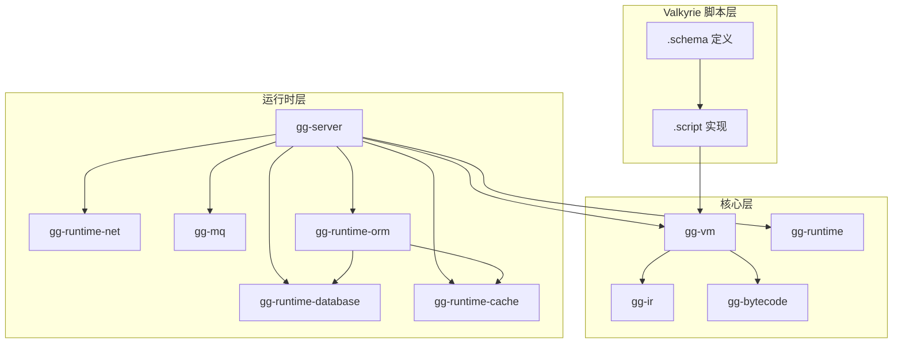

# GG Server 开发计划

## 项目概览

GG Server 是 GG 游戏引擎的服务端运行时，采用 Valkyrie Script → GG IR → GG VM 的执行模型。Rust 层只提供基础设施能力（网络、数据库、缓存等），所有业务逻辑由 Valkyrie 脚本编写。

### 核心设计原则

1. **自研优先**：所有组件皆为自研，不依赖外部框架
2. **脚本驱动**：所有业务逻辑由 Valkyrie 脚本编写
3. **模块解耦**：gg-server、gg-runtime-database、gg-runtime-cache、gg-runtime-net 等独立模块
4. **ORM 抽象**：屏蔽底层数据库差异，支持多种数据库后端
5. **全栈开发**：同一套脚本可运行在客户端和服务端

### 编译运行链路

```
Valkyrie Script → GG IR → GG VM
```

## 模块规划

### 新增模块

| 模块          | 路径                             | 职责       | 状态     |
| ----------- | ------------------------------ | -------- | ------ |
| gg-server   | `projects/runtime/gg-server`   | 服务端运行时核心 | 未开始    |
| gg-runtime-database | `projects/runtime/gg-runtime-database` | 数据库驱动抽象层 | 进行中    |
| gg-runtime-cache    | `projects/runtime/gg-runtime-cache`    | 缓存驱动抽象层  | 进行中    |
| gg-runtime-net      | `projects/runtime/gg-runtime-net`      | 网络协议层    | 进行中    |
| gg-mq       | `projects/runtime/gg-mq`       | 消息队列抽象层  | 未开始    |
| gg-runtime-orm      | `projects/runtime/gg-runtime-orm`      | ORM 抽象层  | 进行中    |

### 模块依赖关系



***

# 网络协议组

- **负责模块**：gg-runtime-net
- **实际进度**：60%
- **已完成功能**：
  - 设计统一的网络抽象接口
  - 实现 TCP 连接管理
  - 实现连接池
  - 实现 WebSocket 驱动存根
  - 实现 HTTP 驱动存根
- **本月工作重点**：
  - 实现 WebSocket 实际功能
  - 实现 HTTP/REST 处理器
  - 实现连接池和心跳机制
- **长期目标**：
  - 支持多种协议的统一抽象
  - 高性能异步 IO
  - 连接复用和负载均衡
  - 完善的错误处理和重连机制
- **相关文件**：
  - gg-runtime-net: `projects/runtime/gg-runtime-net/src/lib.rs`

***

# 数据库组

- **负责模块**：gg-runtime-database, gg-runtime-orm
- **实际进度**：70%
- **已完成功能**：
  - 设计数据库驱动抽象接口
  - 实现 SQLite 驱动
  - 实现数据库连接池
  - 设计 ORM QueryBuilder 接口
  - 实现 ORM 基础 CRUD 操作
- **本月工作重点**：
  - 实现 PostgreSQL 驱动
  - 完善 ORM 功能
  - 实现事务支持
- **长期目标**：
  - 支持 MySQL、MongoDB 等多种数据库
  - 完整的 ORM 功能（关联、事务、迁移）
  - 查询优化和缓存
- **相关文件**：
  - gg-runtime-database: `projects/runtime/gg-runtime-database/src/lib.rs`
  - gg-runtime-orm: `projects/runtime/gg-runtime-orm/src/lib.rs`

***

# 缓存组

- **负责模块**：gg-runtime-cache
- **实际进度**：50%
- **已完成功能**：
  - 设计缓存驱动抽象接口
  - 实现内存缓存驱动
- **本月工作重点**：
  - 实现 Redis 驱动
  - 设计缓存策略接口
  - 实现基础的缓存失效策略
- **长期目标**：
  - 支持多种缓存后端
  - 分布式缓存支持
  - 缓存穿透/雪崩保护
  - 缓存预热和懒加载
- **相关文件**：
  - gg-runtime-cache: `projects/runtime/gg-runtime-cache/src/lib.rs`

***

# 消息队列组

- **负责模块**：gg-mq
- **实际进度**：0%
- **本月工作重点**：
  - 设计消息队列抽象接口
  - 实现内存消息队列
  - 实现 NATS 驱动
  - 设计发布/订阅模式接口
  - 实现消息确认机制
- **长期目标**：
  - 支持多种消息队列后端
  - 消息持久化
  - 死信队列处理
  - 消息追踪和监控
- **相关文件**：
  - gg-mq: `projects/runtime/gg-mq/src/lib.rs`

***

# 服务端运行时组

- **负责模块**：gg-server
- **实际进度**：0%
- **本月工作重点**：
  - 设计 ServerHost trait（扩展 Host trait）
  - 集成 gg-runtime-net、gg-runtime-database、gg-runtime-cache
  - 实现服务启动和生命周期管理
  - 实现 @main 多入口支持
  - 实现脚本热更新机制
- **长期目标**：
  - 完整的服务端运行时
  - 微服务架构支持
  - 服务发现和注册
  - 配置中心集成
  - 监控和日志系统
- **相关文件**：
  - gg-server: `projects/runtime/gg-server/src/lib.rs`

***

## 模块详细设计

### gg-runtime-net 网络协议层

```rust
pub trait NetDriver: Send + Sync {
    fn listen(&mut self, addr: &str) -> Result<()>;
    fn accept(&mut self) -> Result<Box<dyn Connection>>;
    fn shutdown(&mut self) -> Result<()>;
}

pub trait Connection: Send + Sync {
    fn send(&mut self, data: &[u8]) -> Result<()>;
    fn recv(&mut self) -> Result<Vec<u8>>;
    fn close(&mut self) -> Result<()>;
    fn peer_addr(&self) -> Option<String>;
}

pub struct TcpDriver;
pub struct WebSocketDriver;
pub struct HttpDriver;
pub struct ConnectionPool;
```

### gg-runtime-database 数据库层

```rust
pub enum DatabaseType {
    Sqlite,
    Postgres,
    MySql,
    Mongo,
}

pub struct DatabaseConfig {
    pub db_type: DatabaseType,
    pub host: String,
    pub port: u16,
    pub database: String,
    pub username: String,
    pub password: String,
    pub path: String,
}

pub enum DatabaseValue {
    Null,
    Integer(i64),
    Real(f64),
    Text(String),
    Blob(Vec<u8>),
}

pub struct Row {
    data: HashMap<String, DatabaseValue>,
}

pub struct Transaction {
    db_path: String,
    active: bool,
}

pub trait DatabaseDriver: Send + Sync {
    fn connect(config: &DatabaseConfig) -> Result<Self> where Self: Sized;
    fn execute(&mut self, query: &str, params: &[DatabaseValue]) -> Result<u64>;
    fn query(&mut self, query: &str, params: &[DatabaseValue]) -> Result<Vec<Row>>;
    fn begin_transaction(&mut self) -> Result<Transaction>;
    fn close(&mut self) -> Result<()>;
}

pub struct SqliteDriver;
pub struct DatabaseConnectionPool;
```

### gg-runtime-orm ORM 层

```rust
pub enum FilterOp {
    Eq,
    Ne,
    Lt,
    Le,
    Gt,
    Ge,
    Like,
    In,
}

pub trait Repository<T> {
    fn find_by_id(id: DatabaseValue) -> Result<Option<T>>;
    fn query() -> QueryBuilder<T>;
    fn insert(entity: &T) -> Result<T>;
    fn update(entity: &T) -> Result<T>;
    fn delete(entity: &T) -> Result<u64>;
}

pub struct QueryBuilder<T> {
    fn filter(field: &str, op: FilterOp, value: DatabaseValue) -> Self;
    fn order_by(field: &str, desc: bool) -> Self;
    fn limit(n: usize) -> Self;
    fn offset(n: usize) -> Self;
    fn first() -> Result<Option<T>>;
    fn all() -> Result<Vec<T>>;
}
```

### gg-runtime-cache 缓存层

```rust
pub enum CacheValue {
    Null,
    Integer(i64),
    Real(f64),
    Text(String),
    Blob(Vec<u8>),
    Bool(bool),
}

pub trait CacheDriver: Send + Sync {
    fn get(&mut self, key: &str) -> Result<Option<CacheValue>>;
    fn set(&mut self, key: &str, value: CacheValue, ttl: Option<Duration>) -> Result<()>;
    fn delete(&mut self, key: &str) -> Result<bool>;
    fn exists(&mut self, key: &str) -> Result<bool>;
    fn clear(&mut self) -> Result<()>;
}

pub struct MemoryCacheDriver;
pub struct RedisDriver;
```

### gg-mq 消息队列层

```rust
pub trait MessageQueue: Send + Sync {
    fn publish(&mut self, topic: &str, message: &[u8]) -> Result<()>;
    fn subscribe(&mut self, topic: &str, handler: MessageHandler) -> Result<()>;
    fn unsubscribe(&mut self, topic: &str) -> Result<()>;
    fn close(&mut self) -> Result<()>;
}

pub struct NatsDriver;
pub struct MemoryMqDriver;
```

### gg-server 服务端运行时

```rust
pub struct ServerHost {
    inner: EngineHost,
    net: Box<dyn NetDriver>,
    database: HashMap<String, Box<dyn DatabaseDriver>>,
    cache: HashMap<String, Box<dyn CacheDriver>>,
    mq: HashMap<String, Box<dyn MessageQueue>>,
}

impl Host for ServerHost {
    fn call_host_function(&mut self, name: &str, args: Vec<BytecodeValue>) -> Option<BytecodeValue> {
        match name {
            "net_listen" => self.handle_net_listen(args),
            "db_query" => self.handle_db_query(args),
            "cache_get" => self.handle_cache_get(args),
            "mq_publish" => self.handle_mq_publish(args),
            _ => self.inner.call_host_function(name, args),
        }
    }
}

pub struct ServerRuntime {
    vm: Vm,
    host: ServerHost,
    entry_points: Vec<String>,
}
```

***

## 宿主函数设计

Valkyrie 脚本可调用的宿主函数：

### 网络函数

| 函数                 | 参数                            | 返回值  | 说明              |
| ------------------ | ----------------------------- | ---- | --------------- |
| `net::listen`      | port: i32                     | bool | 启动 TCP 监听       |
| `net::ws_listen`   | port: i32                     | bool | 启动 WebSocket 监听 |
| `net::http_listen` | port: i32                     | bool | 启动 HTTP 监听      |
| `net::send`        | conn_id: string, data: bytes | bool | 发送数据            |
| `net::broadcast`   | data: bytes                   | bool | 广播数据            |
| `net::close`       | conn_id: string              | bool | 关闭连接            |

### 数据库函数

| 函数                | 参数                    | 返回值          | 说明      |
| ----------------- | --------------------- | ------------ | ------- |
| `orm::find_by_id` | type: string, id: any | T?           | 按 ID 查找 |
| `orm::query`      | type: string          | QueryBuilder | 创建查询    |
| `orm::insert`     | entity: T             | T            | 插入实体    |
| `orm::update`     | entity: T             | T            | 更新实体    |
| `orm::delete`     | entity: T             | i32          | 删除实体    |

### 缓存函数

| 函数              | 参数                                 | 返回值  | 说明   |
| --------------- | ---------------------------------- | ---- | ---- |
| `cache::get`    | key: string                        | any? | 获取缓存 |
| `cache::set`    | key: string, value: any, ttl: i32? | bool | 设置缓存 |
| `cache::delete` | key: string                        | bool | 删除缓存 |
| `cache::exists` | key: string                        | bool | 检查存在 |

### 消息队列函数

| 函数                | 参数                            | 返回值  | 说明   |
| ----------------- | ----------------------------- | ---- | ---- |
| `mq::publish`     | topic: string, message: any   | bool | 发布消息 |
| `mq::subscribe`   | topic: string, handler: micro | bool | 订阅消息 |
| `mq::unsubscribe` | topic: string                 | bool | 取消订阅 |

***

## 开发里程碑

### Phase 1: 基础设施 (已完成)

- [x] gg-runtime-net: TCP 基础实现
- [x] gg-runtime-database: SQLite 驱动实现
- [x] gg-runtime-cache: 内存缓存实现
- [x] gg-runtime-orm: 基础 CRUD 接口

### Phase 2: 功能完善 (进行中)

- [ ] gg-runtime-net: WebSocket/HTTP 支持
- [ ] gg-runtime-database: PostgreSQL 驱动
- [ ] gg-runtime-cache: Redis 驱动
- [ ] gg-runtime-orm: 完善 ORM 功能

### Phase 3: 核心集成 (计划中)

- [ ] gg-server: ServerHost 实现
- [ ] gg-server: 宿主函数注册
- [ ] gg-server: @main 多入口支持
- [ ] 集成测试

### Phase 4: 高级特性 (计划中)

- [ ] gg-mq: 消息队列实现
- [ ] 热更新机制
- [ ] 微服务架构支持
- [ ] 服务发现和注册
- [ ] 性能优化

***

## 文档计划

### 技术文档

- [ ] gg-runtime-net API 文档
- [ ] gg-runtime-database API 文档
- [ ] gg-runtime-cache API 文档
- [ ] gg-runtime-orm API 文档
- [ ] gg-mq API 文档
- [ ] gg-server API 文档

### 架构文档

- [x] server.md - 服务端架构设计
- [x] schema.md - Schema 定义规范
- [ ] orm.md - ORM 使用指南
- [ ] deployment.md - 部署指南

***

## 发布计划

### 版本规划

- **v0.1.0**：基础网络（TCP）和数据库（SQLite）支持 ✓
- **v0.2.0**：ORM 和内存缓存支持 ✓
- **v0.3.0**：WebSocket/HTTP 支持、PostgreSQL 驱动、Redis 驱动
- **v0.4.0**：gg-server 核心实现、消息队列支持
- **v0.5.0**：微服务架构、热更新机制
- **v1.0.0**：稳定版本

### 发布标准

- 所有测试通过
- 代码覆盖率达到 80% 以上
- API 文档完善
- 性能达到预期目标